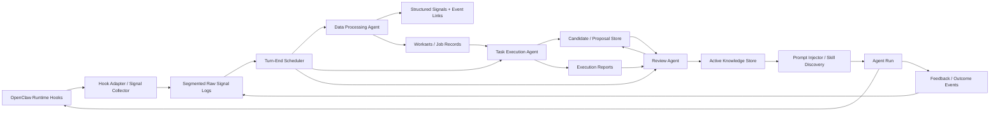
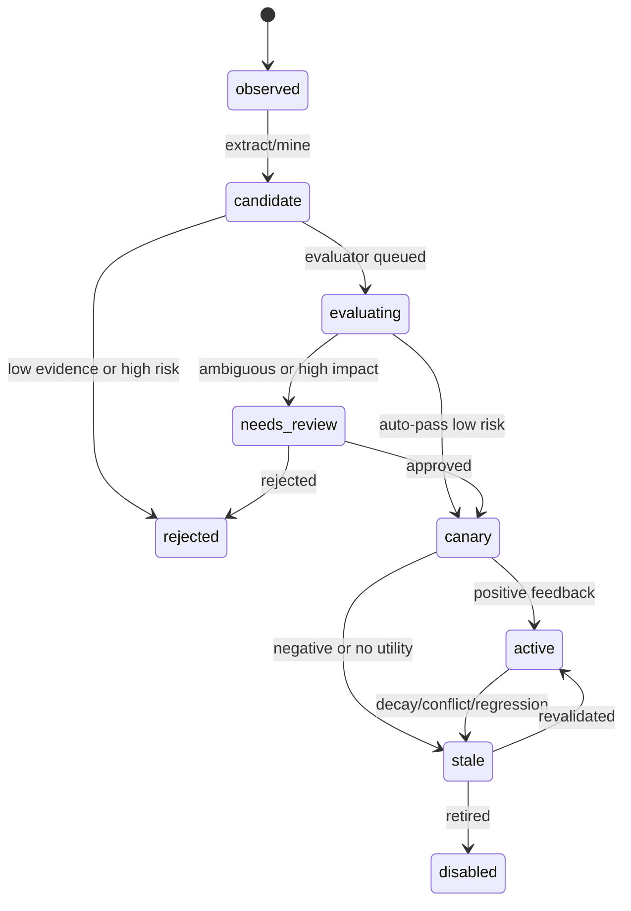

# Self Evolving 框架设计 v2

最后更新：2026-04-18

## 1. 执行摘要

Self Evolving 不应该被设计成“让 Agent 自由改写自己”的单点能力，而应该被设计成一个可治理的闭环框架：从运行时信号中提炼候选知识，通过评估和 review 进入灰度，再在后续任务中按需注入或触发 Skill，最后用真实效果反馈修正置信度、适用范围和版本。

本设计建议采用以下核心决策：

1. 存储层采用混合架构：LanceDB 作为可检索知识与向量/全文索引主存储，SQLite 作为队列、事务状态和 review/eval 元数据存储，文件系统仅作为 executable Skill 的目录载体。
2. 开发语言采用 TypeScript + Python 双运行时：TypeScript 负责 OpenClaw 插件、hook、prompt injector、context engine 近端集成；Python 负责后台 mining、evaluation、skill synthesis、report 生成和实验型算法。Rust 暂不作为主语言，只作为后续高性能/沙箱组件候选。
3. 自进化闭环必须显式建模：Observe -> Propose -> Verify -> Publish -> Use -> Attribute -> Learn/Retire。没有被注入或被调用的知识，不能被算作“进化成功”；没有 attribution 的成功/失败，也不能更新知识置信度。
4. 不同场景采用不同演进算法：Memory 做事实归并、冲突检测和 TTL；Experience 做失败-修复链路和工作流模板挖掘；Profile 做多观察证据的稳定偏好建模；Skill 做可执行流程生成、沙箱验证、版本化灰度和回滚。

MVP 不追求自动生成复杂 Skill 或全局跨用户共享。MVP 应先完成“信号采集 -> 经验候选 -> review -> active knowledge 注入 -> feedback 归因”的闭环，再扩展到 Skill 和画像。

## 2. 背景与目标

OpenClaw 已经具备 workspace、skills、memory、hooks、context engine 和插件机制，但当前能力主要依赖人工维护。随着使用时间增长，会出现以下问题：

- 同类错误跨会话反复发生。
- 调试流程、shell 命令、项目约束难以结构化复用。
- 用户画像和项目画像无法低噪声、按需注入。
- 高频工作流无法自动升级为 Skill。
- 简单追加式 memory 导致 prompt 污染、冲突、过期知识和 token 浪费。

Self Evolving Framework 的目标是构建一个可复用、异步、非阻塞、可评估、可回滚的通用演进层，并优先落地到 OpenClaw 生态。

### 2.1 目标

- 从 OpenClaw 运行时轨迹中采集可用信号，包括对话、工具调用、错误、diff、review、用户纠正和成功确认。
- 将信号提炼为 Memory、Experience、Profile、SkillCandidate 等知识类型。
- 对候选知识进行证据绑定、风险评分、自动评估和人工/agent review。
- 将通过 review 的 active knowledge 低延迟、按需注入到 prompt 或暴露给 Skill discovery。
- 对注入和 Skill 使用建立 attribution，并通过真实后续效果更新知识置信度和生命周期。
- 将框架抽象为通用能力，不只绑定 OpenClaw。

### 2.2 非目标

- MVP 不做模型权重训练或 RL fine-tuning。
- MVP 不允许自进化系统任意修改 OpenClaw core 或业务仓库代码。
- MVP 不默认跨用户共享个人画像或私有经验。
- MVP 不把所有历史上下文都注入 prompt。
- MVP 不以“自动写入 Markdown”作为唯一记忆方式。

## 3. 调研总结

### 3.1 公开研究与实现

| 类别 | 代表工作 | 对本设计的启示 |
|---|---|---|
| Verbal reflection | Reflexion | 将标量或自然语言反馈转成 reflection，并放入 episodic memory，后续 trial 用 reflection 改善决策。适合 Experience candidate 和 failure remediation。 |
| Iterative refinement | Self-Refine | 生成、反馈、改写可以在 test-time 闭环中完成，不要求训练数据或权重更新。适合单个候选知识、Skill 文档和 evaluator prompt 的局部优化。 |
| Memory stream + reflection | Generative Agents | observation、reflection、planning 的组合证明了 memory 不是简单检索，必须周期性合成 higher-level reflection。适合 Memory -> Experience 的后台 consolidation。 |
| Skill library | Voyager | 可执行代码 Skill library + environment feedback + self-verification 能形成 lifelong learning；Skill 必须可解释、可组合、可检索。 |
| Trajectory-grounded skill distillation | Trace2Skill | 不逐条顺序更新 Skill，而是并行分析一批成功/失败轨迹，抽取 trajectory-local lessons，再层级合并为单个综合 Skill；适合避免 skill fragmentation 和在线 sequential overfit。 |
| Agentic memory | A-MEM | 新 memory 加入时应动态链接旧 memory，并可能更新旧 memory 的上下文表示和属性。适合知识网络和冲突/归并设计。 |
| Temporal graph memory | Zep / Graphiti | 企业场景需要动态整合对话和业务数据，且 temporal relationship 对跨会话推理很关键。适合后续 graph/edge table 扩展。 |
| Evolutionary coding | AlphaEvolve / OpenEvolve | LLM 负责提出变体，自动 evaluator 负责验证，程序数据库负责保存 lineage 和选择。适合 Skill/script 演进，但需要强 evaluator 和沙箱。 |
| Open-ended self-improvement | Darwin Godel Machine | 自改进代码必须维护多样化 archive、明确 benchmark、沙箱和人工监督；不能直接用于 MVP 的主链路自修改。 |
| RL training interface | Agent Lightning | agent 执行和训练应解耦，运行时只需输出统一 trajectory/transition 数据。适合作为未来离线训练接口，而非 MVP 必需项。 |
| File-backed agent memory | LangChain Deep Agents | 文件式 memory 透明、易审阅，且支持 progressive disclosure；但应区分 agent/user/org scope、read-only/writeable、hot-path/background updates。 |

公开资料给出的共同结论是：真正可靠的自进化不是单次总结，而是“可执行反馈源 + 持久知识载体 + 选择性注入 + 持续评估”的系统工程。

### 3.2 本地项目调研

#### self-evolving-plugin-pro

该项目已经实现了一个保守型 OpenClaw 学习闭环：

- Node 插件层注册 hooks、commands、auto review 和 prompt injection。
- Python FastAPI 后端维护 signals、genes、expressions、reviews、workspace snapshots 和 verification records。
- `before_prompt_build` 注入 signal protocol 和 active expressions。
- `after_tool_call` 采集工具失败信号。
- `llm_output` 解析 assistant 输出的学习记录，生成 correction/frustration/success/feature_request 信号。
- review 后台任务通过 OpenClaw CLI 以独立 session 运行回看任务。

可继承点：

- 主链路降级原则清晰：backend 不可用时 hook 只返回最小 protocol，不阻塞主任务。
- signal 和 expression 分离正确：signal 是事实，expression 是可注入知识。
- review workset 模型正确：review 不直接扫全量世界，而是用后端准备的有限证据包。
- active/stale/disabled 生命周期可继续沿用。

需要重设计点：

- SQLite 适合事务状态，但不适合语义检索和大规模知识召回。
- expression 注入目前按 hit_count 排序，缺少 scope、semantic relevance、risk、token budget 和效果归因。
- gene/expression 语义偏经验，未覆盖 Profile、Memory、SkillVersion，以及统一 signal 模型中的 feedback/injection。
- 反馈闭环不完整：缺少“某条知识被注入/某个 skill 被使用 -> 任务是否变好”的 attribution。
- structured learning record 依赖模型输出固定模板，适合 MVP 辅助信号，不应作为唯一信号源。

#### self-improving-agent

该项目是 Markdown-first 的轻量自改进 Skill：

- 将 correction、error、feature request 追加到 `.learnings/LEARNINGS.md`、`ERRORS.md`、`FEATURE_REQUESTS.md`。
- 高价值 learning 可人工提升到 `AGENTS.md`、`TOOLS.md`、`SOUL.md`。
- 文件格式透明，适合人工审阅和 git 版本化。

可继承点：

- Markdown 是非常好的 review/publish view。
- learning 类型、priority、status、area、metadata、pattern-key 等字段适合作为 candidate schema 的基础。
- promotion target 说明了 Memory、Tool gotcha、Behavioral guideline 的不同发布位置。

需要补齐点：

- 缺少语义检索、去重、冲突检测和 scope 管理。
- 缺少 evaluator、feedback attribution 和自动过期。
- Markdown 并发写、结构化查询和增量更新成本较高。

#### OpenClaw

OpenClaw 已提供落地所需的关键基础：

- 插件 hook 名称覆盖 `before_prompt_build`、`llm_input`、`llm_output`、`before_tool_call`、`after_tool_call`、`tool_result_persist`、`session_start`、`session_end`、`subagent_*` 等。
- prompt mutation 主要通过 `before_prompt_build` 和 `before_agent_start`。
- context engine 插件可在 `bootstrap`、`assemble`、`ingest`、`afterTurn`、`compact` 等阶段接入。
- memory host SDK 已经有 Markdown memory 文件扫描、chunk、embedding 输入限制等机制。
- skills 使用 progressive disclosure：启动时只加载 metadata/description，需要时再加载 SKILL.md 和 references。

设计含义：

- Self Evolving 应优先作为 OpenClaw plugin + context engine + background service 组合落地，而不是侵入 core。
- 热路径只做轻量采集和注入；耗时提炼与评价放后台。
- 对 Skill discovery 不应私自扫描 workspace，应优先使用 OpenClaw core 暴露的 session skillsSnapshot 或新增 SDK surface。

#### lancedb-claw-internal / openclaw-context-engine

该项目已经验证了 LanceDB 在 OpenClaw context engine 中的可行性：

- `context_messages`、`context_summaries`、`context_state`、`skills` 表用于持久 summary 和 skill search。
- Skill sync 读取 session store 中的 `skillsSnapshot.resolvedSkills`，构造 rows 后通过 LanceDB `mergeInsert(["name"])` 更新。
- Skill search 使用 `desc_vector` 做向量搜索，在 assemble 阶段将动态发现结果加入 system prompt。

设计含义：

- LanceDB 适合作为 active knowledge 和候选知识的语义检索层。
- Skill 表设计可以扩展为更通用的 `knowledge_items` 表。
- `mergeInsert + whenNotMatchedBySourceDelete` 适合 snapshot 型同步，不适合 raw event append。
- `skillsSnapshot` workaround 应在后续沉淀为公开 SDK。

#### Hermes Agent

Hermes 提供了几个值得借鉴的工程实践：

- MemoryStore 将 `MEMORY.md` 和 `USER.md` 作为 bounded curated memory，并在 session start 形成 frozen snapshot，避免 mid-session 改变系统 prompt 破坏 prefix cache。
- memory 写入使用文件锁和原子替换，并扫描 prompt injection / secret exfiltration pattern。
- Skill manager 支持 agent 创建/编辑 Skill，但会校验 frontmatter、目录、路径穿越和安全扫描。
- Skill system 强调 progressive disclosure：列表只给 metadata，按需加载全文和 supporting files。
- release notes 中已有 background memory/skill review、session search、profile isolation 等演进方向。

设计含义：

- Active context 最好按 session 固定快照，避免同一任务中 prompt 基线漂移。
- Agent 生成 Skill 必须进入安全扫描和 review，而不能直接生效。
- Markdown 适合做 curated prompt snapshot，但不适合承担全部 raw signal 和 evaluator 事实源。

#### darwin-skill

`darwin-skill` 是一个专门针对 `SKILL.md` 的 Darwin-style optimizer。它把 Karpathy autoresearch 的“可测量目标 + 实验循环 + git ratchet”映射到 Skill 优化：

- 单一可编辑资产：每轮只优化一个 `SKILL.md`，避免多变量变更导致无法归因。
- 双重评估：结构质量评分 + 实测效果评分，不只检查格式。
- 8 维加权 rubric：frontmatter、工作流清晰度、边界条件、检查点、指令具体性、资源整合、整体架构、实测表现，总分 100。
- 实测效果最高权重：为每个 Skill 设计 2-3 个典型 test prompts，并用 with-skill vs baseline 对比输出质量。
- 独立评分：编辑者和评分者分离，效果维度使用子 agent 或 dry-run 验证，降低“自己改自己评”的偏差。
- 棘轮机制：新分数严格高于旧分才 keep，否则用 `git revert` 回滚，不用 destructive reset。
- 人在回路：每个 Skill 优化完成后展示 diff、分数变化和测试输出对比，用户确认后再继续。
- 结果记录：`results.tsv` 记录 timestamp、commit、skill、old_score、new_score、status、dimension、note、eval_mode。

设计含义：

- Skill Evolution 不能只生成 Skill，还需要持续优化 Skill 本身。
- 对 Skill 的 evaluator 必须同时包含静态结构评分和实际任务效果评分。
- Skill 改动应使用 git branch/commit/revert 形成可审计 lineage。
- 每轮只改一个低分维度，可以让改动与效果提升建立更清晰的 attribution。
- 当 hill-climbing 卡住时，可以引入受控的探索性重写，但必须单独征得确认。

## 4. 核心概念

### 4.1 Signal

Signal 是运行时观测事实，不是结论。来源包括 message、tool call、tool result、错误日志、diff、session summary、用户纠正、成功确认、review comment、CI 结果等。

Signal 要求：

- 保留 source、source_ref、session_id、turn_id、tool_call_id、timestamp。
- 保留 trust、privacy_level、scope 和 redaction 状态。
- 默认不直接注入 prompt。

#### 4.1.1 Prompt 引导的 Signal 采集

Signal 采集可以分为两类：

- Passive capture：从已有 hook 被动采集 message、tool call、tool result、error、diff、session_end 等事件。
- Prompt-guided capture：在对话前通过 `before_prompt_build` 注入一段“反馈/反思规范”，让模型只在明确反馈场景，或明确完成任务后发现可复用成功路径时，输出结构化 learning marker，再在 `llm_output`、`before_message_write` 或 `message_sending` 阶段解析并转换为 Signal。

Prompt-guided capture 的价值是：有些 signal 不在工具层显式存在，例如用户纠正的语义、模型意识到某个流程应被复用、用户确认某条修复路径有效，以及 agent 在成功完成任务后对自身工具链路的复盘。这些可以通过轻量协议让模型在回答中顺手标记，再由插件剥离用户可见文本或转换为后台信号。

推荐协议：

```xml
<self_evolving_signal_protocol>
  仅当出现明确学习价值时，才生成学习标记：
  1. 用户明确纠正、确认、抱怨、评价上一轮处理路径，或提出可复用能力缺口；
  2. 任务执行结束后，你能基于实际工具调用/结果，指出可复用的成功路径、失败原因、规避策略、验证方法或后续改进建议。
  普通任务请求、报错描述、上下文补充，不要生成学习标记。
  学习标记必须短小、结构化、可解析；不能包含 secret、完整日志、大段原文或未经脱敏的私有内容。
  不要把学习标记当成结论发布；它只是供后台 review/mining 的候选信号。
</self_evolving_signal_protocol>
```

建议标记格式：

```markdown
### 学习记录
- 类型：用户纠正 | 用户挫败 | 成功确认 | 能力缺口 | 可复用流程 | 成功复盘 | 失败复盘 | 部分成功复盘
- 结果：成功 | 失败 | 部分成功 | 不确定 | 不适用
- 触发：用户反馈 | 工具结果 | 执行复盘 | 模型自检
- 标签：feedback,correction,workflow
- 置信度：0.80
- 摘要：一句可复用的观察或教训
- 依据：一句话说明来自哪个反馈、工具结果或执行现象
- 建议：后续遇到类似情况应尝试或避免什么
```

执行复盘标记只应在同时满足以下条件时使用：

1. 当前任务或一个关键子任务已经有明确结果，例如成功、失败、部分成功或不确定。
2. Agent 能指出一个可复用模式，而不只是泛泛地说“这次成功了”或“这次失败了”。
3. 复盘基于实际观察到的工具调用、执行结果或用户反馈。
4. 复盘能说明后续应尝试什么、避免什么，或如何更早验证。
5. 复盘足够短小，适合作为候选信号，而不是完整复盘报告。

有效执行复盘示例：

- “生成最终文档前先做结构校验，可以提前发现格式回归。”
- “评估 Skill 时，对比加载 Skill 和不加载 Skill 的输出，比只做静态检查更能反映实际效果。”
- “目标产物是 docx 时，保留 Markdown 作为源文件，再重新导出 docx，便于审阅和迭代。”
- “命令失败的直接原因是路径不存在；后续执行前应先用 `ls` 或 `test -e` 验证目标路径。”
- “这次只完成了 Markdown 更新，docx 导出失败；后续应把导出作为单独验证步骤，失败时仍保留源文件。”

不应生成标记的情况：

- 只是普通回答，任务尚未完成。
- 某个命令成功或失败了，但没有可复用模式。
- 复盘需要保存 secret、完整日志或私有对话内容。
- 任务结果只是偶然现象，或成功/失败标准并不明确。

解析行为：

1. `llm_output` 读取 assistant 输出，解析 marker。
2. 将 marker 转为 `SignalRecord`，例如 `correction`、`frustration`、`success_confirmation`、`feature_request`、`workflow_candidate`、`success_reflection`、`failure_reflection`、`partial_success_reflection`。
3. `message_sending` 或 `before_message_write` 从用户可见回复和 transcript 中剥离内部 marker，避免污染对话和后续上下文。
4. 原始 marker 作为 redacted payload 保存，真正进入后续 mining 的是规范化 signal。

防护规则：

- 该协议只能引导信号标记，不能要求模型自行写 active memory 或发布 Skill。
- marker 只能作为低到中等置信度信号，不能绕过 evaluator/review。
- 成功/失败/部分成功复盘只能提供 positive/negative evidence 或 ExperienceCandidate 输入，不能直接提升为 active knowledge。
- 解析失败必须静默降级，不影响主任务。
- 必须限制触发条件，避免每轮输出“学习记录”造成噪声。
- 对用户可见的学习确认可以保留，但内部 XML/marker 不应进入最终消息或长期 transcript。

### 4.2 Candidate（候选知识）

Candidate 是从 Signal 或多个 Candidate 中生成的候选知识。包括 MemoryCandidate、ExperienceCandidate、ProfileCandidate、SkillCandidate。

Candidate 要求：

- 必须绑定 evidence_refs。
- 必须有 scope、confidence、risk、expected_utility。
- 必须经过 evaluator 或 review 才能进入 active。

### 4.3 Active Knowledge（激活知识）

Active Knowledge 是通过 review/eval 后允许影响未来任务的知识。包括：

- MemoryItem：事实、历史事件、项目约束。
- ExperienceItem：可复用经验、踩坑规则、操作策略。
- ProfileItem：用户/项目/组织画像。
- SkillVersion：可执行或可复用工作流。

### 4.4 Injection / Feedback Signals（注入与反馈信号）

Injection 与 Feedback 是闭环的核心，但在 MVP 中它们不是两张独立业务表，而是统一 signal 模型中的两类 `structured_signals.kind`：

- `structured_signals.kind = injection`
- `structured_signals.kind = feedback`

其中：

- `injection` 记录某次 prompt/skill 注入使用了哪些 knowledge、selection reason 和 token budget。
- `feedback` 记录某次 knowledge injection 或 Skill use 后的真实结果。
- 完整审计正文保留在 `raw_signal_events` JSONL 中。
- 可查询的归因字段进入 `structured_signals` 和 `event_links`。

没有 `feedback` signal，就不能声称自进化有效；没有 `injection` signal，就不能严肃做 attribution。

### 4.5 Scope（作用域）

Scope 决定知识可见性和隔离边界：

- user：仅特定用户。
- workspace/project：仅特定仓库或项目。
- agent：某个 agent 实例。
- org/team：组织级共享，默认只读，必须经过更严格 review。
- global：框架级知识，MVP 不开放自动发布。

## 5. 目标架构



### 5.1 运行时组件

| 组件 | 是否在热路径 | 职责 |
|---|---:|---|
| Hook Adapter | 是 | 接入 OpenClaw hooks，统一事件格式，快速入队。 |
| Signal Protocol Injector | 是 | 在 `before_prompt_build` 注入低噪声反思/反馈规范，引导模型只在明确用户反馈或有可复用执行复盘时输出可解析 marker。 |
| Prompt Injector | 是 | 在 `before_prompt_build` / context engine `assemble` 里按 token budget 注入 active knowledge。 |
| Skill Discovery Adapter | 是 | 将 Skill metadata / dynamic discovery 暴露给 OpenClaw。 |
| Raw Signal Logs | 近热路径 | 按 workspace / day 切分的统一 append-only JSONL 日志；多 hook 必须通过单个进程内 `RawSignalWriter` 串行写入，不阻塞主任务。 |
| Turn-End Scheduler | 否 | 每轮 `agent_end/session_end` 后做轻量 gating，按条件尝试唤起三类后台 Agent；不做业务处理。 |
| Data Processing Agent | 否 | 消费 `raw_signal_events`，完成 schema validation、redaction、dedup、correlation、typed processors、event links 和 workset 构建；替代旧设计中的确定性处理角色。 |
| Task Execution Agent | 否 | 消费 Data Processing Agent 产出的 ready workset，执行 mining、reflection、attribution、profile consolidation、skill candidate 等语义任务。 |
| Review Agent | 否 | 消费 candidate/proposal/report/review workset，编排 Verify / Review / Publish；低风险可自动发布，高风险进入 human checkpoint；通过受控 publish phase 写 LanceDB active/canary rows、必要的 Skill 目录和 cache invalidation。 |
| Feedback Tracker | 是 + 否 | 热路径记录 injection/use id；后台计算 outcome 和归因。 |

### 5.2 OpenClaw 接入点

面向完整自进化闭环，OpenClaw 的接入点应覆盖六类能力：输入观测、工具轨迹、模型轨迹、上下文注入、生命周期收敛、跨 agent/长期上下文。MVP 只是其中的一个最小闭环子集。

#### 5.2.1 完整接入面

| Capability | OpenClaw Integration Point | Purpose | Output |
|---|---|---|---|
| 用户输入与反馈观测 | `message_received`, `before_dispatch`, `inbound_claim` | 捕获用户偏好、纠正、抱怨、成功确认、能力缺口；在多渠道场景下保留 channel/user/session 维度。 | `user_message`, `user_feedback_candidate`, `capability_gap` |
| Prompt 构建前注入 | `before_prompt_build`, context engine `assemble` | 注入 signal protocol、active knowledge、profile/memory/experience/skill hints；记录 injection attribution id。 | `prompt_injection_raw`, `signal_protocol_injected` |
| 模型输入输出观测 | `llm_input`, `llm_output`, `before_agent_reply` | 记录模型、usage、摘要、assistant self-report；解析 learning marker 和执行复盘 marker。 | `llm_trace`, `learning_marker`, `execution_reflection` |
| 工具调用轨迹 | `before_tool_call`, `after_tool_call`, `tool_result_persist` | 捕获工具序列、参数摘要、结果摘要、耗时、错误签名、success-after-failure。 | `tool_call_started`, `tool_call_completed`, `tool_failure`, `tool_result_summary` |
| 用户可见消息清理 | `before_message_write`, `message_sending`, `message_sent` | 剥离内部 marker，记录发送结果，避免污染 transcript 和用户消息。 | `marker_stripped`, `message_delivery_result` |
| 运行生命周期 | `agent_end`, `session_start`, `session_end`, `before_reset` | 生成 run/session outcome、关闭 session 边界，并触发 session reflection 与 session review check。 | `run_finished`, `session_outcome`, `session_review_check_requested` |
| Compaction/Memory 生命周期 | `before_compaction`, `after_compaction`, context engine `ingest/compact/maintain` | 捕获压缩前后上下文变化，将可持久化内容与临时上下文分离。 | `compaction_event`, `memory_ingest_event` |
| Skill/Context discovery | context engine `bootstrap/assemble`, skills snapshot/SDK | 同步可见 Skill 元数据，支持动态 Skill discovery 和 active knowledge 检索。 | `skill_inventory_snapshot`, `dynamic_skill_hint` |
| Subagent/多 agent 轨迹 | `subagent_spawning`, `subagent_spawned`, `subagent_ended`, `subagent_delivery_target` | 记录 delegation、子任务结果和父子任务归因。 | `subagent_trace`, `delegation_outcome` |
| Gateway/后台入口 | `gateway_start`, `gateway_stop`, `/evolve` commands, scheduled jobs | 启动后台 scheduler / agent runtime、健康检查、手动 review、定时 consolidation。 | `runtime_health`, `manual_review_request`, `scheduled_job_event` |

完整接入面并不意味着所有 hook 都在第一阶段启用。原则是：

- 热路径 hook 只采集和入队，不做深处理。
- 所有事件统一进入 RawSignalEnvelope。
- 长耗时 processing/mining/evaluation/review/publish 都在三类后台 Agent 中执行。
- 接入点按能力打开，允许通过配置关闭高成本或高隐私风险 hook。

#### 5.2.2 MVP 推荐接入点

MVP 推荐先接入能形成“注入规范 -> 捕获反馈/工具结果 -> 形成 Signal -> session 反思 -> ExperienceCandidate -> review/publish -> 后续注入 -> attribution”的最小闭环：

| Priority | Integration Point | MVP Responsibility |
|---|---|---|
| P0 | `before_prompt_build` | 注入 signal protocol 和 active knowledge；记录 injection raw event。 |
| P0 | `llm_output` | 解析 learning marker 和执行复盘 marker，转换为 structured signal。 |
| P0 | `after_tool_call` | 捕获 tool success/failure、耗时、错误签名。 |
| P0 | `agent_end` / `session_end` | 生成 run outcome 和边界 raw signal，触发 Turn-End Scheduler 尝试启动 Data Processing Agent、Task Execution Agent、Review Agent。 |
| P0 | `before_message_write` / `message_sending` | 剥离内部 marker，避免污染用户消息和 transcript。 |
| P1 | `message_received` | 捕获用户显式偏好、纠正、需求。 |
| P1 | `before_tool_call` | 捕获工具调用开始事件，补齐工具序列。 |
| P1 | `tool_result_persist` | 使用持久化后的工具结果摘要，避免重复截断。 |
| P1 | `llm_input` | 记录模型、usage 和 prompt 摘要，用于 attribution 和成本评估。 |

P2 延后接入：

- `before_compaction` / `after_compaction`：用于长任务和 memory 生命周期治理。
- `subagent_spawning` / `subagent_ended`：用于多 agent 归因。
- `before_reset`：用于异常终止和未完成任务复盘。
- `gateway_start` / `gateway_stop`：用于后台 scheduler / agent runtime lifecycle 和健康检查。

### 5.3 OpenClaw 多 Hook Signal 采集

OpenClaw 场景下不建议让每个 Hook 自己完成完整业务处理，也不建议所有 Hook 共用一个同步大函数。推荐分层策略是：

```text
Hook 层：每个 Hook 有独立 adapter
Raw Log 层：统一 RawSignalEnvelope
Data Processing Agent 层：统一 dispatcher + typed processors，消费 raw signal
Task Execution Agent 层：按 ready workset 异步执行
Review Agent 层：Verify / Review / Publish 编排
Storage 层：raw event append-only + structured signal/candidate tables
```

#### 5.3.1 Hook 层：薄 Adapter

Hook 层只做热路径最小工作：

```text
OpenClaw Hook
-> extract minimal event
-> sanitize / truncate
-> attach runtime metadata
-> RawSignalWriter.enqueue(RawSignalEnvelope)
-> return immediately
```

每个 Hook 应有独立 adapter，因为不同 hook 的 payload 结构、信任度和语义差异很大：

| Hook | Adapter 输出 | 说明 |
|---|---|---|
| `message_received` | `user_message`, `user_feedback_candidate` | 捕获用户显式偏好、纠正、能力诉求。 |
| `before_prompt_build` | `prompt_injection_raw`, `signal_protocol_injected` | 记录注入了哪些 active knowledge 和 signal protocol。 |
| `llm_input` | `llm_input_snapshot` | 保存摘要、模型、usage 关联信息；避免保存完整 prompt。 |
| `llm_output` | `llm_output_snapshot`, `learning_marker` | 解析学习标记、执行复盘标记和 assistant self-report。 |
| `before_tool_call` | `tool_call_started` | 记录工具名、参数摘要、call id。 |
| `after_tool_call` | `tool_call_completed`, `tool_failure` | 记录成功/失败、耗时、错误签名。 |
| `tool_result_persist` | `tool_result_summary` | 使用持久化后的 result 摘要，避免重复截断。 |
| `before_message_write` / `message_sending` | `marker_stripped` | 剥离内部 marker，避免污染用户消息和 transcript。 |
| `agent_end` / `session_end` | `run_finished`, `session_outcome`, `session_review_check` | 关闭 trajectory，触发后续 reflection/mining，并生成每轮 review check 输入。 |
| `subagent_spawning` / `subagent_ended` | `subagent_trace` | Phase 2 之后用于多 agent 任务归因。 |

Hook adapter 禁止执行：

- LLM 调用。
- candidate 生成。
- Skill 文件写入。
- active knowledge 发布。
- 长耗时检索或跨 session 扫描。

#### 5.3.2 统一 RawSignalEnvelope

所有 Hook adapter 输出统一 envelope，保证后续可以跨 hook 重建 run/turn/session 轨迹。

```ts
type RawSignalEnvelope = {
  appendId: string;   // physical log row id
  eventUid: string;   // deterministic logical event id
  source: "openclaw_hook";
  hook:
    | "message_received"
    | "before_prompt_build"
    | "llm_input"
    | "llm_output"
    | "before_tool_call"
    | "after_tool_call"
    | "tool_result_persist"
    | "before_message_write"
    | "message_sending"
    | "agent_end"
    | "session_end"
    | "subagent_spawning"
    | "subagent_ended";
  kind: string;
  runId?: string;
  sessionId?: string;
  sessionKey?: string;
  turnId?: string;
  llmCallId?: string;
  toolCallId?: string;
  injectionId?: string;
  parentEventId?: string;
  sequenceNo?: number;
  userId?: string;
  workspaceId?: string;
  timestampMs: number;
  trust: number;
  privacyLevel: "public" | "private" | "secret_redacted";
  contentPreview: string;
  payloadJson: unknown;
  refs: {
    sessionFile?: string;
    messageId?: string;
    toolName?: string;
    sourceRef?: string;
    filePath?: string;
    artifactId?: string;
    knowledgeIds?: string[];
    skillIds?: string[];
    candidateIds?: string[];
  };
};
```

Envelope 设计原则：

- `appendId` 是物理日志行标识，只用于原始 JSONL 记录定位，不用于幂等。
- `eventUid` 是逻辑事件标识，必须由稳定字段 canonical hash 生成；它是 replay、去重和跨表引用的统一锚点。
- `payloadJson` 保存结构化摘要，不保存未经脱敏的大段原始内容。
- `contentPreview` 用于 dashboard/review 快速浏览，必须截断。
- `runId/sessionId/turnId/llmCallId/toolCallId/injectionId` 尽量填充，缺失时由后台 correlation 补齐。
- `refs` 保存可确定关联的业务对象，例如文件、artifact、knowledge、skill、candidate。
- 每条事件 append-only，不在 hook 层覆盖更新。

`eventUid` 推荐按 hook 使用不同的 canonical basis 生成。例如：

- `before_prompt_build`：`workspaceId + hook + sessionId + runId + turnId + injectionId + knowledgeIds(sorted)`
- `after_tool_call`：`workspaceId + hook + sessionId + runId + turnId + toolCallId + toolName + normalizedArgs + resultFingerprint`
- `llm_output`：`workspaceId + hook + sessionId + runId + turnId + llmCallId + markerFingerprint`
- `session_end`：`workspaceId + hook + sessionId + runId + outcome`

对于缺少稳定 ID 的 hook，只能做保守 canonicalization；无法稳定识别时宁可不做强去重，也不要把两次合法事件误合并。

#### 5.3.3 Segmented Raw Signal Logs

MVP 不再把 `raw_signal_events` 设计成可变 queue 表，而是改成 **按 workspace、按天切分的统一 append-only JSONL 日志**。Hook 不直接 append 文件，而是统一把 `RawSignalEnvelope` 交给同一个进程内 `RawSignalWriter`，由它串行落盘；Data Processing Agent 作为增量 log consumer 消费这些文件。

推荐目录：

```text
.self-evolving/raw-signals/
  workspace_<id>/
    2026-04-21/
      events.open.jsonl
      events-0001.jsonl
      events-0002.jsonl
```

每条记录仍然是 `RawSignalEnvelope`，并带 `hook` 字段；文件按天组织，当前写入文件为 `events.open.jsonl`，单文件达到约 `10MB` 时由 `RawSignalWriter` 串行轮转到下一个 segment。MVP 先不要求持久 checkpoint，也不要求 raw event 级状态位。

这个设计的约束是：

- raw log append-only，不回写 `pending/processed/failed`。
- 单进程、多 hook 并发场景下，所有 hook 必须通过同一个 `RawSignalWriter` 串行落盘；不允许各 hook 自己 direct append 同一 JSONL。
- 单 writer 负责轮转协议：写入 `events.open.jsonl`，达到阈值后封口并 rename 为正式 segment，再切到新的 `.open` 文件。
- Data Processing Agent 只在内存里维护当前 workspace/day 文件的读取游标。
- 增量游标以 `byte offset` 为主，`last_event_id` 只做校验，不作为主游标。
- DPA 遇到未完成的最后一行时跳过，等待下次继续；遇到完整坏行时写入 quarantine/error JSONL 并继续处理后续行。
- restart 后允许 replay，不保证 exactly-once；正确性依赖派生写入幂等。
- 查询和调试不直接依赖 raw log 扫描，而依赖 `structured_signals`、`event_links`、`worksets` 等派生表。

派生层统一使用 `eventUid` 作为幂等锚点：

- `structured_signals`：`eventUid + processor_name + processor_version (+ signal_type)`
- `event_links`：`from_id + to_id + link_type + processor_name + processor_version`
- `workset_events`：`workset_id + eventUid`
- `knowledge_candidates` / `proposals`：`workset_id + candidate_type + generator_version + evidence_set_hash`

因此 replay 可以重复读取同一段 raw log，但不会重复放大 signals、links、workset evidence 或 attribution evidence。

#### 5.3.4 Data Processing Agent：统一 Dispatcher + 类型化 Processor

Data Processing Agent 替代旧设计中的确定性处理位置：它是消费 `raw_signal_events` 的唯一主 lane，默认不调用 LLM，负责把 raw signal 变成可计算、可审计、可 replay 的结构化数据。内部采用统一 dispatcher，但按 signal 类型路由到不同 processor：

```text
SignalDispatcher
  -> SchemaValidator
  -> Redactor
  -> Deduplicator
  -> Correlator
  -> Router
      -> MessageProcessor
      -> ToolTraceProcessor
      -> LlmMarkerProcessor
      -> PromptInjectionProcessor
      -> SessionOutcomeProcessor
      -> FeedbackProcessor
      -> SubagentTraceProcessor
```

Data Processing Agent 的统一职责：

- schema validation。
- redaction。
- 去重。
- session/run/turn correlation。
- ordering。
- 派生状态更新（只更新 `structured_signals`、`worksets` 等 SQLite 表，不回写 raw log）。
- structured signal 写入。
- event_links 写入。
- workset 构建。
- metrics 和错误告警。

typed processor 的职责：

- `MessageProcessor`：识别显式偏好、纠正、能力缺口。
- `ToolTraceProcessor`：维护 tool trajectory，生成 failure signature、success-after-failure、potential fix。
- `LlmMarkerProcessor`：解析 `### 学习记录`，生成 correction/reflection/workflow candidate signal。
- `PromptInjectionProcessor`：把 prompt injection raw event 规范化为 `structured_signals.kind = injection`，并写入归因所需 links。
- `SessionOutcomeProcessor`：在 agent/session 结束时生成 outcome summary，并关闭 session/turn 边界。
- `FeedbackProcessor`：把用户确认/纠正、工具成功/失败和 injection/use 关联起来，生成 `structured_signals.kind = feedback`。

#### 5.3.5 三类后台 Agent 与薄 Adapter

这里需要明确区分四类执行单元：adapter、Turn-End Scheduler、Data Processing Agent、Task Execution Agent、Review Agent。它们不是同一个概念，也不应该承担同一类责任。

```text
OpenClaw Hook
  -> Adapter: 热路径同步采集
  -> Queue: append-only raw event
  -> Turn-End Scheduler: 每轮结束后轻量 gating
  -> Data Processing Agent: 消费 raw signal，产出 structured signals / event links / worksets
  -> Task Execution Agent: 消费 ready workset，产出 candidate / proposal / execution report
  -> Review Agent: 消费 candidate / proposal / report，完成 verify / review / publish
```

| 执行单元 | 生命周期 | 是否在热路径 | 是否应使用 LLM | 主要输入 | 主要输出 | 典型职责 |
|---|---|---:|---:|---|---|---|
| Adapter | 短生命周期同步函数 | Yes | No | 单个 Hook payload | `RawSignalEnvelope` | 字段提取、脱敏、截断、补 runtime id、入队。 |
| Turn-End Scheduler | 每轮 `agent_end/session_end` 后触发的轻量调度器 | No | No | boundary raw event、raw log lag、workset/candidate/review 状态、cooldown/budget | 三类 Agent 的启动尝试 | 判断是否需要启动；single-flight/cooldown 可先在内存中维护，不做业务处理。 |
| Data Processing Agent | 单 workspace single-flight，也支持手动 batch / replay | No | 默认 No | workspace/day unified JSONL raw logs | structured signals、`event_links`、workset | validation、redaction、dedup、correlation、ordering、marker parsing、tool trajectory stitching、workset construction。 |
| Task Execution Agent | 短生命周期异步 Agent，由 ready workset 触发 | No | Yes | `SessionWorkset` / `TrajectoryWorkset` / `AttributionWorkset` / `ProfileConsolidationWorkset` | candidate、proposal、execution report | session reflection、experience mining、profile consolidation、skill candidate、attribution proposal、semantic self-check。 |
| Review Agent | 短生命周期异步 Agent，由 review workset 或待审对象触发 | No | Yes + rules | `SessionReviewWorkset`、candidate、proposal、execution report、eval report、human approval | `ReviewReport`、approve/reject/needs_change/needs_human、active/canary knowledge、Skill version | verify/review/publish、风险解释、冲突检查、人审门禁、LanceDB 更新、executable Skill 目录写入和 cache invalidation。 |

核心关系：

- Adapter 负责“把现场事实安全带出来”，不能阻塞主链路。
- Turn-End Scheduler 负责“每轮结束后是否值得启动后台能力”，只做 gating、预算、cooldown、single-flight 和幂等判断；MVP 可全部在内存中维护。
- Data Processing Agent 负责“把 raw signal 变成可计算结构”，应尽量确定性、可重放、可测试；它替代旧设计中的确定性处理角色。
- Task Execution Agent 负责“需要语义判断和候选生成的部分”，必须有 workset、budget、timeout、retry limit 和审计输出。
- Review Agent 负责“对 candidate/proposal/report 做 verify/review/publish”，可以写 active/canary knowledge 和物化视图，但必须经过 policy gate、human checkpoint 和幂等 publish transaction。

Adapter 禁止做：

- LLM 调用。
- 跨 session 扫描。
- candidate 生成。
- confidence 更新。
- Skill 发布或文件写入。

Data Processing Agent 应优先做：

- schema validation、redaction、去重和派生状态更新。
- session/run/turn/tool/LLM/injection correlation。
- `event_links` 写入。
- tool trajectory stitching。
- `### 学习记录` 的结构化解析。
- workset 组装，并在边界闭合时将 workset 标记为 `ready`。

运行约束：

- 同一个 workspace 本地只允许一个 Data Processing Agent 主处理 unified JSONL raw logs，避免重复消费 raw signal。
- Data Processing Agent、Task Execution Agent、Review Agent 分别有独立 cooldown、single-flight key 和 budget；MVP 可在内存中维护。
- raw log 不存在单条 event claim；Data Processing Agent 只按 `workspace/day + byte offset` 增量消费，并通过 `eventUid + processor_name + processor_version` 保证派生幂等。
- 同一 workset 的语义处理只由 Task Execution Agent claim 一次；同一 candidate/proposal 版本的 review 只由 Review Agent claim 一次。
- 不引入多 Data Processing Agent 并发、lease 抢占或分布式原始事件队列；失败恢复通过 `worksets.failed`、candidate/review 状态、重试和手动 replay 处理。
- 后续如果需要横向扩展，只扩展 Task Execution Agent / Review Agent 的并发；Data Processing Agent 仍保持单 workspace single-flight。

Task Execution Agent 只处理 Data Processing Agent 准备好的有限证据包，不直接扫描全量数据库，不按单个 Hook 运行：

```ts
type TaskWorkset = {
  runId: string;
  sessionId: string;
  taskSummary: string;
  messageSummary: string;
  toolTraceSummary: string;
  failures: Array<{ signature: string; evidenceRefs: string[] }>;
  successes: Array<{ signature: string; evidenceRefs: string[] }>;
  userFeedback: Array<{ kind: string; summary: string; evidenceRef: string }>;
  injectedKnowledge: Array<{ id: string; injectionId: string }>;
  candidateRelatedHistory: Array<{ id: string; summary: string }>;
};
```

Task Execution Agent 的输出：

- MemoryCandidate。
- ExperienceCandidate。
- ProfileCandidate。
- SkillCandidate。
- FeedbackAttribution。
- ExecutionReport。

如果 Task Execution Agent 需要更多上下文，应通过受控 retrieval API 请求补充证据，并把新增 evidence refs 写回 workset 或 execution report，不能绕过 Data Processing Agent 直接修改 active knowledge。

三类后台 Agent 理论上不竞争，因为它们的消费对象、写集合和状态机不同：

| Lane | 消费对象 | 主要写集合 | 不允许写入 |
|---|---|---|---|
| Data Processing Agent | unified JSONL raw log 的新增字节区间 | `structured_signals`、`event_links`、`worksets` | candidate/proposal、active knowledge、published skill。 |
| Task Execution Agent | `worksets(status=ready)` | candidate/proposal、execution report、workset status | raw event 主状态、active knowledge、published skill。 |
| Review Agent | candidate/proposal/report/review workset、human approval | review report、review decision、LanceDB active/canary rows、Skill directory、cache invalidation | raw event 主状态、新建语义 candidate、修改原始 evidence。 |

跨 lane 只通过状态和 append-only records 协作，不通过同步等待：Data Processing Agent 完成后可以追加一次 `scheduler.recheck(reason=data_processed)`，让 Turn-End Scheduler 再尝试启动 Task Execution Agent / Review Agent；Task Execution Agent 生成 candidate/proposal 后也可以追加一次 `scheduler.recheck(reason=candidate_created)`，让 Review Agent 在条件满足时启动。

#### 5.3.6 调度模型

每轮对话或 agent 执行结束后，都应尝试启动三类后台 Agent，但必须是有条件、有限频率、可幂等的尝试，而不是无条件启动。`agent_end` 和 `session_end` 都可能出现，Turn-End Scheduler 应通过 `workspace_id + session_id + turn_id/run_id + scheduler_policy_version` 在内存中去重同一轮启动尝试。

推荐链路：

```text
agent_end / session_end hook
  -> Adapter 写 RawSignal(run_finished/session_boundary_hint)
  -> Turn-End Scheduler.tryStartAgents(reason=turn_end)
      -> tryStart(Data Processing Agent)
      -> tryStart(Task Execution Agent)
      -> tryStart(Review Agent)
  -> return immediately

Data Processing Agent completed
  -> scheduler.recheck(reason=data_processed)
      -> tryStart(Task Execution Agent)
      -> tryStart(Review Agent)

Task Execution Agent completed
  -> scheduler.recheck(reason=task_executed)
      -> tryStart(Review Agent)

Review Agent completed
  -> approved items are active/canary and materialized
```

三类启动都采用 `attempt -> gate -> claim -> run -> report`：

```ts
async function onTurnEnd(boundary: BoundaryEvent) {
  await appendRawSignal(boundary);
  await turnEndScheduler.tryStartAgents({
    workspaceId: boundary.workspaceId,
    sessionId: boundary.sessionId,
    runId: boundary.runId,
    turnId: boundary.turnId,
    reason: "turn_end",
  });
}
```

调度约束：

- Hook 不直接写文件，而是统一交给 `RawSignalWriter` 追加到 workspace/day unified JSONL；Turn-End Scheduler 不再统计 pending rows，只根据 boundary event 唤醒 DPA。
- Data Processing Agent 以每个文件的 `byte offset` 为主游标做增量 tail read，`last_event_id` 仅作校验。
- Data Processing Agent 一次读取一小批新增行，然后在内部执行多个 task / processor。
- restart 后允许 replay，不保证 exactly-once；幂等由 `eventUid + processor_name + processor_version` 保证。
- Task Execution Agent 和 Review Agent 不直接消费 raw event；它们只消费 Data Processing Agent 或前序 Agent 产出的 ready workset、candidate、proposal。
- 三类 Agent 的启动尝试至少在日志/metrics 中记录 `reason`、`gate_decision`、`skip_reason`、`idempotency_key`、`started_at`、`finished_at`、`cost` 和 `result_summary`；MVP 不要求落独立表。

##### 5.3.6.1 Data Processing Agent Tasks

这类任务由 Data Processing Agent 执行，不调用 LLM，不做语义判断，主要处理结构化数据和关系链。它们应该可重放、可单测、可批处理。

| 名称 | 推荐命名 | 是否 Agent Job | 输入 | 输出 | 边界 |
|---|---|---:|---|---|---|
| `SignalNormalizeJob` | `SignalNormalizeTask` | No | unified JSONL raw lines | typed signals、normalized refs | 只做 schema 校验、字段规范化、脱敏和摘要，不生成 candidate。 |
| `ToolTraceUpdateJob` | `ToolTraceUpdateTask` | No | `before_tool_call` / `after_tool_call` / `tool_result_persist` | tool trace、failure signature、success-after-failure marker | 只根据 `toolCallId/runId/turnId` 串联工具事件，不解释经验价值。 |
| `MarkerParseJob` | `MarkerParseTask` | No | `llm_output` marker | structured reflection signal | 只解析 `### 学习记录` 等结构化片段；模型自述只能作为 signal，不能直接发布为 knowledge。 |
| `InjectionSignalJob` | `InjectionSignalTask` | No | `before_prompt_build` / prompt injector output | `structured_signals(kind=injection)`、`injected_knowledge` links | 只记录哪些 knowledge 被注入、token budget、selection reason，不判断效果。 |
| `FeedbackSignalJob` | `FeedbackSignalTask` | No | user feedback、tool outcome、session outcome | `structured_signals(kind=feedback)`、初步 outcome label | 只做显式反馈抽取和规则化 outcome，不直接更新 confidence。 |

触发方式：

- 每轮 `agent_end/session_end` 后 Turn-End Scheduler 尝试启动。
- 单个 Data Processing Agent 持续消费或 batch drain。
- 支持手动 replay 某个 `sessionId/runId`。

完成条件：

- 结构化 signal 已写入。
- 必要的 `event_links` 已写入。
- 若事件边界闭合，例如 `session_end`、`agent_end` 或 trajectory 完成，对应 workset 被标记为 `ready`。
- 当前 batch 的文件 offset 已推进到新的安全位置；restart 时允许从稍早位置 replay。

Data Processing Agent 启动条件：

- 存在当前 workspace/day unified JSONL 在内存游标之后还有新增字节，或刚刚追加了 `agent_end/session_end` boundary event。
- 当前 workspace 没有运行中的 Data Processing Agent。
- 未命中最小启动间隔，除非新增字节超过 batch 阈值，或当前事件是 `session_end/agent_end` 边界。
- 本次读取数量不超过 batch size，单次执行不超过时间预算。
- replay / retry 使用 `eventUid + processor_name + processor_version` 幂等键。

##### 5.3.6.2 Task Execution Agent Jobs

这类任务需要 LLM 或 Agent 做语义判断。它们不直接消费零散 raw event，而是消费 Data Processing Agent 准备好的 workset。

| 名称 | 是否 Agent Job | 输入 | 输出 | 边界 |
|---|---:|---|---|---|
| `SessionReflectionJob` | Yes | `SessionWorkset` | session reflection、可学习点、open questions | 只总结本 session，不直接改 active knowledge。 |
| `ExperienceMiningJob` | Yes | `SessionWorkset` / `TrajectoryWorkset` | `ExperienceCandidate`、workflow pattern、failure-remediation lesson | 必须引用 evidence refs；低证据候选进入 review，不自动发布。 |
| `SkillCandidateJob` | Yes | 多个 trajectory workset 或高置信 workflow pattern | `SkillCandidate`、skill draft、测试建议 | executable skill 必须经过沙箱测试和人工/可信 review。 |
| `AttributionJob` | Yes | `AttributionWorkset`、`injectionId`、outcome、feedback | attribution proposal、conflict flag、explanation | 判断 direct/weak/neutral/conflicting，输出 score delta proposal；不能直接更新 confidence。 |
| `ProfileConsolidationJob` | Yes | profile-related signals、scope、历史 profile facts | `ProfileCandidate` 或 profile update proposal | 辅助摘要、偏好稳定性判断和冲突解释；不能直接写 canonical profile。 |

触发方式：

- `workset.status = ready` 且 `workset.kind` 属于 Task Execution Agent 可消费类型。
- Data Processing Agent 通过不同 `worksets.kind` 表达语义任务，例如 `experience_mining`、`attribution`、`profile_consolidation`、`skill_candidate`。
- 用户手动 `/evolve run` 或 scheduled offline mining。
- 累计 N 个同类 trajectory 或 failure signature。

Agent Job 必须有：

- workset boundary。
- token / cost budget。
- timeout。
- retry limit。
- evidence refs。
- structured output schema。
- review status。

Task Execution Agent 启动条件：

- 存在 `worksets.status = ready` 且 `worksets.kind` 属于可执行语义任务。
- 当前 workspace/session 未超过 Task Execution Agent 并发上限。
- session/workset 满足证据阈值，例如足够事件、显式用户反馈、可审计 injection/outcome link，或候选生成价值超过阈值。
- 未命中 cooldown 和成本预算限制。
- 幂等键未处理过，例如 `workset_id + job_type + agent_policy_version + evidence_set_hash`。

##### 5.3.6.3 Review Agent：Verify / Review / Publish

Review Agent 是独立 lane，不再混在 Task Execution Agent 的 Agent Job 列表里。它默认在每轮 `agent_end/session_end` 后被 Turn-End Scheduler 尝试启动，但只有存在 review-worthy item 时才运行；否则被 gate 掉，或在低频 noop 策略下写一条轻量 noop report。

Review Agent 的推荐触发链路：

```text
agent_end / session_end
  -> Turn-End Scheduler 尝试启动 Data Processing Agent / Task Execution Agent / Review Agent
  -> Data Processing Agent 关闭 session boundary，构建 SessionReviewWorkset(status=ready)
  -> Task Execution Agent 可能生成 candidate / proposal / execution report
  -> scheduler.recheck(reason=data_processed/task_executed)
  -> Review Agent 消费 SessionReviewWorkset 或待审对象
  -> Review Agent 写 ReviewReport + recommendation
  -> 如果 recommendation 可发布且 policy gate 通过，Review Agent 执行 publish phase
  -> 写 active/canary knowledge、LanceDB、必要的 Skill 目录和 cache invalidation
```

Review Agent 启动条件：

- 存在 `SessionReviewWorkset(status=ready)`，且其中有新 candidate/proposal/conflict/high-risk feedback。
- 或存在 candidate/proposal 进入 `needs_review`。
- 或存在 approved-but-not-materialized candidate/proposal、evaluation failed/ambiguous、negative/conflicting attribution、高风险 profile update、executable SkillCandidate。
- 当前 workspace/session 没有运行中的 Review Agent，且未命中 review cooldown。
- 若没有待 review item，只允许按低频策略写 noop report，例如同一 session 最多一次，或同一 workspace 每 N 分钟最多一次。
- 幂等键未处理过，例如 `review_target_id + version + review_policy_version`。

`SessionReviewWorkset` 应包含：

- 本轮 session summary 和 outcome。
- 本轮新生成的 candidate / proposal。
- attribution proposals、profile candidates、skill candidates。
- 用户显式确认、纠正、否定或撤销信号。
- Data Processing Agent 已发现的 conflicts、risk score、scope 和 policy constraints。
- 本轮触达或注入过的 active knowledge / skill refs。

Review Agent 输出：

```json
{
  "review_status": "noop|reviewed|needs_human|needs_change|failed",
  "recommendation": "noop|approve_canary|approve_active|reject|needs_change|needs_human",
  "reviewed_items": ["candidate_or_proposal_id"],
  "published_items": ["knowledge_or_skill_version_id"],
  "evidence_refs": ["event_or_signal_id"],
  "reason": "No new candidate, proposal, conflict, or high-risk feedback in this session."
}
```

约束：

- Review Agent 不能全库巡逻，只能看 scheduler 指定的 review workset / target set。
- Review Agent 可以 publish，但只能 publish 当前 review target set 中已通过 policy gate 的对象。
- 高风险、共享 scope、executable Skill、跨用户影响的变更必须先进入 human checkpoint。
- Review Agent 的 publish phase 必须是幂等事务，幂等键建议为 `target_id + target_version + review_policy_version + publish_mode`。
- Review Agent 不允许在 publish phase 新建语义 candidate、修改原始 evidence 或绕过 review report。
- Review Agent 负责 LanceDB active/canary rows、必要的 Skill 目录和 cache invalidation。

##### 5.3.6.4 不同任务的触发模式

触发模式应由 Data Processing Agent 根据边界、增量 raw log、证据条件和派生状态准备，由 Turn-End Scheduler 根据 readiness/cooldown/budget 启动对应 lane，而不是由 Agent 自己扫描全库后决定。MVP 阶段直接使用 `worksets.status`、`event_links`、candidate/proposal 状态和少量专用状态字段触发；完整形态如果需要更复杂的 priority、lease 和跨进程能力，再引入独立 `jobs` 表。

推荐触发器类型可以先分四类：

| 触发器 | 适合任务 | 说明 |
|---|---|---|
| Boundary trigger | `AttributionJob`, `SessionReflectionJob` | `session_end`, `agent_end`, trajectory closed。 |
| Evidence trigger | `AttributionJob`, `ProfileConsolidationJob` | injection + outcome、N 条同类 signal。 |
| Feedback trigger | `AttributionJob`, `Review Agent` | 用户明确确认、纠正、否定。 |
| Scheduled trigger | `ProfileConsolidationJob`, `ExperienceMiningJob` | 每小时/每天 batch consolidate。 |

各任务的推荐触发方式：

| 任务 | 类型 | MVP 触发条件 | 去重 / 幂等键 | 触发后动作 |
|---|---|---|---|---|
| `SignalNormalizeTask` | Deterministic | unified JSONL 中出现新的 raw line | `eventUid + processor_version` | 写 typed signal、normalized refs。 |
| `ToolTraceUpdateTask` | Deterministic | 出现 `before_tool_call`、`after_tool_call` 或 `tool_result_persist` 事件。 | `toolCallId + processor_version` | 更新 tool trace，写 `tool_result_of` link，必要时生成 failure signature。 |
| `MarkerParseTask` | Deterministic | `llm_output` 中存在 `### 学习记录` 或 execution reflection marker。 | `eventUid + marker_version` | 解析为 reflection/correction/workflow signal；不直接生成 active knowledge。 |
| `InjectionSignalTask` | Deterministic | `before_prompt_build` 完成 active knowledge selection。 | `injectionId` | 写 `structured_signals(kind=injection)` 和 `injected_knowledge` links。 |
| `FeedbackSignalTask` | Deterministic | `message_received`、`session_end`、tool outcome 中出现确认、纠正、失败或成功信号。 | `eventUid + feedback_type + target_ref` | 写 `structured_signals(kind=feedback)` 和初步 outcome label。 |
| `SessionReflectionJob` | Task Execution Agent | `SessionWorkset.status = ready`，且 session 有足够事件或用户反馈。 | `workset_id + reflection_version` | 生成 session reflection 和可学习点，不直接发布。 |
| `ExperienceMiningJob` | Task Execution Agent | trajectory workset ready，或同类 failure/workflow 达到阈值 N。 | `trajectory_id/workset_id + mining_version` | 生成 `ExperienceCandidate`、workflow pattern 或 failure-remediation lesson。 |
| `SkillCandidateJob` | Task Execution Agent | 同类 successful trajectory 达到阈值，或 ExperienceCandidate 被 review 标记为可程序化。 | `workflow_pattern_id + skill_generator_version` | 生成 `SkillCandidate` 和测试建议，进入 Verify / Review。 |
| `AttributionJob` | Task Execution Agent | workset ready 且存在 injection/skill use + outcome/feedback + 可审计 link path。 | `workset_id + injection_id/skill_use_id + knowledge_id + outcome_signal_id/feedback_signal_id` | Data Processing Agent 构建 `AttributionWorkset(status=ready)`；Task Execution Agent 消费后写 attribution proposal。 |
| `ProfileConsolidationJob` | Task Execution Agent | 同 scope 下 profile-related signals 达到阈值，或出现强显式偏好/纠正。 | `scope_type + scope_id + profile_key + evidence_set_hash` | Data Processing Agent 构建 `ProfileConsolidationWorkset(status=ready)`；Task Execution Agent 消费后写 profile candidate。 |
| `SessionReviewCheck` | Review Agent | `agent_end/session_end` 后 `SessionReviewWorkset.status = ready` 且有待审对象，或低频 noop 策略允许。 | `session_id + review_policy_version + target_set_hash` | 检查本轮是否有需 review 的 candidate/proposal/conflict；没有则写 noop `ReviewReport`。 |
| `ReviewTarget` | Review Agent | candidate/proposal 进入 `needs_review`，或用户手动 `/evolve review`。 | `candidate_id/proposal_id + version + review_policy_version` | 生成 review report 和 approve/reject/needs_change/needs_human 建议。 |

在 Attribution/Profile 这类混合语义任务中，触发不应该由 Agent 自己决定，而应该由 Data Processing Agent 根据状态和证据条件准备 ready workset。但 Data Processing Agent 与 Task Execution Agent 之间不应形成“前者调后者并等待结果再提交”的相互依赖。推荐最终设计是：Data Processing Agent 只准备 ready workset；Task Execution Agent 独立消费；Agent 输出 proposal / candidate；后续 Verify / Review / Publish 决定是否生效。

可以理解成解耦的四段流程：

```text
事件进入
  -> Data Processing Agent 发现满足条件
  -> 构建 HybridWorkset(status=ready)
  -> Task Execution Agent 消费 ready HybridWorkset
  -> Agent/Judge 解释证据、自检并输出 proposal/candidate
  -> Task Execution Agent 对 Agent 输出做 schema、evidence_refs、幂等键等最小机械校验
  -> 保存为 AttributionProposal / ProfileCandidate
```

###### AttributionJob 的触发

`AttributionJob` 应该在同时满足这些条件时触发：

1. `workset.status = ready`。
2. `workset.kind = attribution`，或 session / trajectory 中存在 attribution evidence。
3. Workset 内存在 `injectionId` 或 `skillUseId`。
4. Workset 内存在 outcome / feedback / tool result。
5. `event_links` 能连通 injection / use 与 outcome / feedback。
6. 这条 evidence chain 没有被处理过。

典型触发点：

```text
agent_end / session_end
  -> Data Processing Agent 关闭 session boundary
  -> 构建 SessionWorkset
  -> 发现本轮有 injectionId + feedback/outcome
  -> 生成 AttributionWorkset(status=ready) 或将 session workset 标记 attribution_ready
  -> Task Execution Agent 消费并生成 AttributionProposal
```

也可以由用户反馈触发：

```text
用户后续说：“刚才那个经验不对”
  -> message_received
  -> FeedbackSignalTask 识别 negative feedback
  -> Data Processing Agent 根据 candidateId / injectionId / recent session 查到相关 workset
  -> 构建 AttributionWorkset(status=ready)
  -> Task Execution Agent 消费并生成 AttributionProposal
```

MVP 直接用 `AttributionWorkset(status=ready)` 表达证据边界和可消费状态：

```text
worksets.kind = attribution
worksets.status = ready
```

Task Execution Agent claim `worksets(status=ready, kind=attribution)` 后执行。这里的 Agent runtime 可以和 Data Processing Agent 部署在同一个后台进程中，但逻辑上只消费 ready workset，不要求触发它的 Data Processing Agent 等待结果。

###### ProfileConsolidationJob 的触发

`ProfileConsolidationJob` 不应该每条 profile signal 都跑。它适合 batch 或阈值触发：

1. 同一 scope 下累计 N 条 profile-related signals。
2. 或出现强用户纠正 / 明确偏好。
3. 或距离上次 consolidation 超过一段时间。
4. 或某条 profile candidate 被后续反馈冲突。

例如用户多次说：

```text
- “以后用中文描述”
- “这里不要写英文”
- “中文描述”
```

Data Processing Agent 识别这些是同一 scope 的 profile / preference signal，累计达到阈值：

```text
scope = user + workspace
signal_type = language_preference
count >= 3
```

于是构建：

```text
ProfileConsolidationWorkset(status=ready)
```

然后由 Task Execution Agent 调用 Agent / Judge 判断：

- 这是稳定偏好，还是当前文档任务里的临时要求？
- scope 应该是 user 级、workspace 级，还是 document/topic 级？
- 是否与已有 profile 冲突？

###### Data Processing Agent 与 Task Execution Agent 的伪代码

```ts
async function prepareHybridWorksets(worksetId: string) {
  const ws = await loader.load(worksetId);

  if (canRunAttribution(ws)) {
    await createAttributionWorkset(ws, { status: "ready" });
  }

  if (canRunProfileConsolidation(ws)) {
    await createProfileConsolidationWorkset(ws, { status: "ready" });
  }
}

function canRunAttribution(ws: HydratedWorkset) {
  return (
    ws.hasInjectionOrSkillUse &&
    ws.hasOutcomeOrFeedback &&
    ws.hasAuditableLinkPath &&
    !ws.wasEvidenceChainProcessed
  );
}

async function taskExecutionAgentLoop() {
  const ws = await claimReadyHybridWorkset();
  const result = await agentJudge.interpret(ws); // Agent/Judge
  await persistProposal(result, {
    validate: ["schema", "workset_id", "evidence_refs", "idempotency_key"],
  });
  await markWorksetCompleted(ws.worksetId);
}
```

需要避免的触发方式：

- Agent 自己全库扫描后决定要更新哪条知识。
- 单条弱语义相似 signal 直接触发 confidence 更新。
- 仅因为 session 成功就给所有注入知识加分。
- replay 时重复触发同一个 evidence chain，导致分数重复更新。

##### 5.3.6.5 MVP 不引入独立 Jobs 表

MVP 不把 raw log 建成 queue，也不引入独立 `jobs` 表。调度、claim、retry 直接落在现有派生状态上：

- raw log 始终 append-only，不记录 `pending/processed/failed`。
- Data Processing Agent 只更新 `structured_signals`、`event_links`、`worksets` 等派生表。
- Task Execution Agent 只 claim `worksets(status=ready)`。
- Review Agent 只 claim `candidate/proposal/review metadata(status=needs_review)` 或 `SessionReviewWorkset(status=ready)`。
- Turn-End Scheduler 只看 `worksets/candidate/review` 状态做启动 gating，不回写 raw log。

MVP 的 claim / retry 语义：

- Task Execution Agent claim 时把 `worksets.status` 从 `ready` 改成 `processing`。
- 成功后写 `completed`；失败后根据 `retry_count` 规则回到 `ready` 或标记 `failed`。
- Review Agent 对 candidate/proposal 采用同样语义：`needs_review -> reviewing -> approved/rejected/failed`。
- replay 可以重复读取 raw log，但不会重复放大派生结果；是否再次触发语义执行由 `workset.status + idempotency_key` 决定。

MVP 典型查询：

```sql
select *
from worksets
where status = 'ready'
order by updated_at asc
limit 10;
```

`worksets` 保留边界和执行状态：

```text
worksets.status:
  open | ready | processing | completed | failed | needs_review
```

candidate/proposal/review 元数据保留各自状态机：

```text
candidate/proposal/review metadata status:
  candidate | evaluating | needs_review | reviewing | approved | rejected | canary | active | failed
```

后续如果出现跨进程 lease、复杂 priority、暂停/取消/超时审计等需求，再把这些状态抽成独立 `jobs` 表；但这不是 MVP 前置条件。

#### 5.3.7 Hook 优先级

MVP Hook 优先级：

| 优先级 | Hooks | 原因 |
|---|---|---|
| P0 | `before_prompt_build`, `llm_output`, `after_tool_call`, `agent_end/session_end`, `before_message_write/message_sending` | 覆盖 signal protocol 注入、marker 解析、工具失败、任务结尾和 marker 清理。 |
| P1 | `message_received`, `before_tool_call`, `tool_result_persist`, `llm_input` | 完整重建 trajectory，改善 attribution 和 outcome 判断。 |
| P2 | `before_compaction`, `after_compaction`, `subagent_spawning`, `subagent_ended`, `before_reset` | 长任务、多 agent、memory 生命周期和异常结束归因。 |

#### 5.3.8 端到端流程

端到端流程需要体现几条关键边界：

- Hook adapter 只在热路径采集、注入和清理，不做复杂处理。
- Turn-End Scheduler 在每轮 `agent_end/session_end` 后有条件地尝试启动三类后台 Agent，启动失败或被 gate 掉都要可观测。
- Data Processing Agent 增量 tail unified raw log 的新增字节区间，并在内部路由多个 task / processor；它替代旧设计中的确定性处理角色。
- Task Execution Agent 独立消费 `ready` worksets，不等待或回调触发它的 Data Processing Agent。
- Review Agent 独立消费 review workset / candidate / proposal / report，完成 review decision 和受控 publish。
- Candidate / proposal 不直接生效，必须进入 Verify / Review / Publish 状态机。

```text
before_prompt_build
  -> select active knowledge from cache
  -> inject signal protocol + active knowledge
  -> generate injectionId
  -> RawSignal(prompt_injection_raw / signal_protocol_injected)
  -> return prompt mutation immediately

message_received
  -> RawSignal(user_message)
  -> return immediately

before_tool_call
  -> RawSignal(tool_call_started)
  -> return immediately

after_tool_call
  -> RawSignal(tool_call_completed)
  -> if failed: RawSignal(tool_failure)
  -> return immediately

llm_output
  -> RawSignal(llm_output)
  -> capture learning/execution-reflection marker preview if present
  -> return immediately

before_message_write / message_sending
  -> strip internal markers
  -> RawSignal(marker_stripped / message_delivery_result)
  -> return sanitized user-visible message

agent_end / session_end
  -> RawSignal(run_finished)
  -> RawSignal(session_boundary_hint)
  -> Turn-End Scheduler.tryStartAgents(reason=turn_end)
      -> attempt Data Processing Agent
      -> attempt Task Execution Agent
      -> attempt Review Agent
  -> return immediately

Data Processing Agent
  -> tail workspace/day unified JSONL from in-memory offset
  -> route by hook/kind to processing tasks
  -> SignalNormalizeTask
  -> ToolTraceUpdateTask
  -> MarkerParseTask
  -> InjectionSignalTask
  -> FeedbackSignalTask
  -> write structured signals / event_links
  -> append injection / feedback raw audit records to JSONL when applicable
  -> update tool trace / trajectory fragments / workset_events
  -> if boundary reached: mark SessionWorkset or TrajectoryWorkset(status=ready)
  -> if session ended: create SessionReviewWorkset(status=ready)
  -> if hybrid eligibility met: create AttributionWorkset or ProfileConsolidationWorkset(status=ready)
  -> advance in-memory file offsets
  -> scheduler.recheck(reason=data_processed)

Task Execution Agent
  -> scan ready worksets
  -> load HydratedWorkset
  -> run SessionReflectionJob / ExperienceMiningJob / SkillCandidateJob
  -> or run AttributionJob / ProfileConsolidationJob
  -> Agent/Judge explains evidence and self-checks output
  -> validate schema / evidence_refs / idempotency_key
  -> persist MemoryCandidate / ExperienceCandidate / ProfileCandidate / SkillCandidate
  -> persist AttributionProposal
  -> persist ExecutionReport
  -> mark workset completed / failed / needs_review
  -> scheduler.recheck(reason=task_executed)

Review Agent
  -> scan SessionReviewWorkset / candidate / proposal / execution report
  -> gate by review-worthy items, cooldown, single-flight and budget
  -> run verify/review policy and optional LLM judge
  -> persist ReviewReport(status=noop|reviewed|needs_human|needs_change|failed)
  -> if recommendation is approve_canary/approve_active and policy gate passes:
       write active/canary knowledge or skill version
       update LanceDB and Skill directory when executable
       invalidate active context cache
  -> mark review workset completed / failed / needs_human / published

Verify / Review / Publish
  -> evaluate candidates and proposals
  -> consume ReviewReport recommendations
  -> apply Review Agent recommendation for medium-risk changes
  -> human checkpoint for high-risk/shared/executable changes
  -> Review Agent publishes active/canary knowledge or skill version
  -> Use records injection_id / skill_use_id
  -> later Attribution/Learn updates confidence, utility, ttl, or retirement status
```

关键边界：

- `before_prompt_build` 可以生成 `injectionId` 并入队 raw event；正式的 `structured_signals(kind=injection)` 和 `injected_knowledge` links 由 `InjectionSignalTask` 写入。
- `llm_output` 阶段只捕获 marker 预览；结构化解析由 Data Processing Agent 内的 `MarkerParseTask` 完成。
- `agent_end/session_end` 写入边界信号后只触发 Turn-End Scheduler；是否关闭 workset、是否生成 attribution/profile workset，由 Data Processing Agent 判断。
- 每轮结束后都尝试启动 Review Agent，但 Review Agent 只有在存在待审对象或低频 noop 策略允许时才运行。
- Task Execution Agent 保存的是 candidate / proposal / execution report，不直接更新 active knowledge、canonical profile 或 published skill。
- Review Agent 保存 review report，并在 recommendation、policy gate 和 human checkpoint 满足时直接物化 active knowledge / Skill。
- replay 时可以重新读取历史 raw log segments，但派生结果必须通过 `eventUid + processor_name + processor_version` 等幂等键去重。

### 5.4 多 Hook 事件关联与 Workset Stitching

多 Hook 采集的关键问题不是“每个 Hook 能不能识别出完整语义”，而是“每个 Hook 能不能产出足够稳定的关联键”，并让后台可以把同一件事在不同 Hook、不同轮次、不同 session 中的证据串成可审计的关系链。

完整设计应同时覆盖确定性 ID 关联、artifact / failure / topic 规则关联、语义关联、人工修正和冲突拆分；MVP 阶段只先启用确定性 ID 和关系表串联。也就是说，系统第一阶段优先通过 `sessionId`、`runId`、`turnId`、`llmCallId`、`toolCallId`、`injectionId`、`knowledgeId`、`filePath` 等字段把事件串起来，但 schema 和流程需要为后续 topic thread、semantic linker 和 graph view 留好位置。

#### 5.4.1 设计原则

- Hook adapter 只产出事实和关联字段，不在热路径里判断“这是不是同一件事”。
- 后台 Correlator / Stitcher 负责把多个 Hook 的事件串成 trajectory、workset 和 attribution evidence。
- 确定性 ID 关联优先于模型判断。只要能用 ID、父子关系、时间顺序或 artifact ref 关联，就不调用 LLM。
- 不能确定关联时，不应强行更新知识置信度；可以先保留为 unlinked signal 或进入 review。
- 关联结果本身也要可审计：为什么两个事件被连在一起，应该写入 link type、confidence 和 reason。

#### 5.4.2 ID 体系

需要显式区分几类 ID：

| ID 类型 | 字段 | 生成方 | 用途 |
|---|---|---|---|
| Workspace ID | `workspaceId` | OpenClaw / plugin | 隔离不同项目和权限边界。 |
| Session ID | `sessionId`, `sessionKey` | OpenClaw runtime | 串联一次会话内的多轮消息和工具调用。 |
| Run ID | `runId` | Agent runtime | 串联一次 agent 执行生命周期。 |
| Turn ID | `turnId` | plugin / runtime | 串联同一轮用户输入、prompt、模型输出和工具调用。 |
| LLM Call ID | `llmCallId` | plugin | 关联 `llm_input`、`llm_output`、prompt 注入和 assistant 输出。 |
| Tool Call ID | `toolCallId` | OpenClaw tool runtime | 关联 `before_tool_call`、`after_tool_call` 和 `tool_result_persist`。 |
| Injection ID | `injectionId` | Prompt Injector | 关联被注入的 knowledge 和后续 attribution。 |
| Knowledge / Skill ID | `knowledgeId`, `skillId` | Self Evolving store / OpenClaw skill runtime | 关联知识注入、Skill 使用和反馈结果。 |
| Artifact ID | `artifactId`, `filePath` | adapter / normalizer | 关联同一文件、文档、代码模块或输出产物。 |
| Workset ID | `worksetId` | Stitcher | 后台聚合后生成，作为 Agent review 和 attribution 的证据边界。 |

其中前八类是输入侧 ID，`worksetId` 是后台派生 ID。MVP 不要求每个事件都有全部字段，但必须尽量填充当前 Hook 能可靠获得的字段。

#### 5.4.3 关系表

Raw event 保持 append-only。跨事件关系不要直接写死在 raw 表里，而是使用关系表表达：

```sql
event_links (
  link_id text primary key,
  from_type text,      -- event | signal | workset | knowledge | skill
  from_id text,
  to_type text,
  to_id text,
  link_type text,      -- same_turn | tool_result_of | generated_by | feedback_for | uses_knowledge
  confidence real,
  linker text,         -- deterministic | rule | human | future_semantic
  reason text,
  created_at integer
)
```

推荐的 `link_type`：

| link_type | 含义 | 主要来源 |
|---|---|---|
| `same_session` | 两个事件属于同一 session。 | `sessionId` |
| `same_run` | 两个事件属于同一 agent run。 | `runId` |
| `same_turn` | 用户输入、prompt、模型输出、工具调用属于同一轮。 | `turnId` |
| `llm_output_of` | `llm_output` 对应某次 `llm_input`。 | `llmCallId` |
| `tool_result_of` | 工具结果对应某次工具调用。 | `toolCallId` |
| `generated_by` | 某个 signal 来自某个 raw event。 | processor 写入 |
| `injected_knowledge` | 某次 prompt 注入包含某条 knowledge。 | `injectionId`, `knowledgeId` |
| `used_skill` | 本轮实际触发或加载了某个 Skill。 | `skillId` |
| `feedback_for` | 用户反馈或 outcome 指向某次 injection、candidate 或 skill use。 | `injectionId`, `candidateId`, `skillId` |
| `mentions_artifact` | 事件涉及某个文件、文档或产物。 | `filePath`, `artifactId` |
| `included_in_workset` | 某个事件被纳入某个 workset。 | Stitcher 写入 |

这张表让系统像关系型数据库一样可查询，也保留了图式关系的扩展空间。

#### 5.4.4 Workset 表

Workset 是后台 Agent 的输入边界。至少维护两张表：

```sql
worksets (
  workset_id text primary key,
  kind text,           -- session | trajectory | attribution | review
  workspace_id text,
  session_id text,
  run_id text,
  root_turn_id text,
  root_artifact_id text,
  status text,         -- open | ready | processing | completed | failed
  time_start integer,
  time_end integer,
  summary text,
  outcome_label text,
  created_at integer,
  updated_at integer
)

workset_events (
  workset_id text,
  event_id text,
  role text,           -- goal | prompt | llm_output | tool_trace | injection | feedback | outcome
  relevance_score real,
  added_by text,       -- deterministic | rule | human
  primary key (workset_id, event_id)
)
```

workset 生成规则：

- `session_end` 或 `agent_end` 后生成 `session` workset。
- 如果一个 run 内存在连续工具调用，则生成 `trajectory` workset。
- 如果本轮存在 `injectionId`，并且后续有 outcome 或用户反馈，则生成 `attribution` workset。
- 如果同一 `filePath/artifactId` 在同一 session 内被多次提及或修改，可把相关事件放入同一个 trajectory workset。

#### 5.4.5 Stitching 流程

推荐后台流程：

```text
RawSignalEnvelope
  -> SchemaValidator
  -> ID Normalizer
  -> Deterministic Linker
  -> Signal Processor
  -> Trajectory Stitcher
  -> Workset Builder
  -> Attribution / Mining / Review
```

各阶段职责：

1. `ID Normalizer`：规范化 session、run、turn、tool、LLM、injection、file path 和 skill id。
2. `Deterministic Linker`：基于相同 ID、父子 ID、时间顺序和 artifact ref 写入 `event_links`。
3. `Signal Processor`：从 raw event 生成 typed signal，并通过 `generated_by` 关联回原始事件。
4. `Trajectory Stitcher`：按 `runId/turnId/toolCallId` 重建工具链路，形成成功/失败路径。
5. `Workset Builder`：把相关事件写入 `worksets` 和 `workset_events`。
6. `Attribution / Mining / Review`：只消费 workset，不直接扫描全量 raw event。

#### 5.4.6 跨多轮对话的 MVP 处理

跨多轮对话描述同一件事时，MVP 先使用可确定的关联线索：

- 同一 `sessionId` 内的连续 `turnId`。
- 同一 `runId` 内的上下游事件。
- 同一 `filePath`、`artifactId`、`knowledgeId`、`candidateId` 或 `skillId`。
- 用户显式指代已经被系统记录的对象，例如“这条经验”“刚才这个文件”“上一个 Skill”。
- `parentEventId` 或 `sourceRef` 指向前序事件。

如果只能靠“语义上看起来相关”才能关联，MVP 不自动合并，不自动影响 attribution 分数。可以把这类事件标记为：

```text
link_status = needs_review
reason = possible_same_topic_but_no_deterministic_key
```

这不是说语义关联不重要，而是说语义关联不应在 MVP 阶段承担 confidence 更新的主责任。MVP 可以记录“疑似相关”的候选关系，但不自动合并、不自动归因、不自动更新知识分数。

#### 5.4.7 完整形态：Topic Thread

完整系统需要 `topic_thread` 来表示跨多轮、跨 session 的“同一件事”。它不是 raw event，也不是 workset，而是更长生命周期的主题或问题实例。例如：

- “Self Evolving Design 文档完善”
- “Attribute 概念解释”
- “OpenClaw 多 Hook 采集与串联”
- “docx roundtrip 校验流程”
- “某个 Skill 在执行中反复失败”

推荐 schema：

```sql
topic_threads (
  topic_thread_id text primary key,
  workspace_id text,
  scope_type text,       -- user | project | workspace | org
  scope_id text,
  title text,
  summary text,
  status text,           -- open | active | resolved | stale | split | merged
  root_event_id text,
  root_artifact_id text,
  root_failure_signature_id text,
  confidence real,
  created_by text,       -- deterministic | rule | agent | human
  created_at integer,
  updated_at integer
)

topic_thread_events (
  topic_thread_id text,
  event_id text,
  role text,             -- root | evidence | followup | feedback | resolution | conflict
  link_confidence real,
  added_by text,         -- deterministic | rule | semantic | human
  reason text,
  primary key (topic_thread_id, event_id)
)
```

Topic thread 的生成方式分阶段：

| 阶段 | 生成方式 | 是否进入 MVP | 说明 |
|---|---|---:|---|
| P0 | 显式 ID / artifact / candidate 规则 | Yes | 同一 session、同一文件、同一 candidate、同一 injection。 |
| P1 | failure signature / workflow pattern 规则 | Later | 多次工具失败或相同修复路径形成同一问题实例。 |
| P2 | embedding 相似度召回 + 规则校验 | Later | 找到疑似同一主题，但需要置信度和 evidence。 |
| P3 | LLM linker / human merge-split | Later | 处理“刚才那个”“上次讨论的方案”等弱指代。 |

Topic thread 与 workset 的区别：

- `topic_thread` 是长期主题容器，可以跨 session 累积证据。
- `workset` 是一次后台 Agent 任务的有限输入包，必须有清晰边界和 token budget。
- 一个 topic thread 可以产生多个 workset；一个 workset 也可以引用多个 topic thread，但 MVP 应尽量保持 1 个主 topic。

#### 5.4.8 完整形态：语义关联 Linker

语义关联用于处理没有稳定 ID 的跨轮指代和相似问题，但必须被设计成“候选关系生成器”，而不是不可审计的自动合并器。

输入：

- 新增 raw event 或 signal。
- 近期 session 内的事件窗口。
- 同 workspace / project 下的 artifact、candidate、knowledge、skill、failure signature。
- 已存在的 topic thread 摘要。

输出：

```sql
link_candidates (
  candidate_id text primary key,
  from_type text,
  from_id text,
  to_type text,
  to_id text,
  proposed_link_type text,
  score real,
  evidence_json text,
  decision text,          -- pending | accepted | rejected | needs_human
  decided_by text,        -- rule | agent | human
  created_at integer,
  decided_at integer
)
```

语义关联的候选信号：

- 文本 embedding 相似度。
- 共同 artifact，例如同一文件、同一 PR、同一 Skill 目录。
- 共同 failure signature，例如相同命令、相似错误栈、相似退出码。
- 显式指代表达，例如“刚才那个”“上一个方案”“这个经验”。
- 时间邻近，例如同一 session 内连续多轮围绕同一对象。
- 用户反馈对象，例如用户在后续轮次否定前面某条经验。

语义 Linker 的决策规则：

| 条件 | 处理 |
|---|---|
| 有强 ID 证据 | 直接写 `event_links`，`linker=deterministic`。 |
| 有 artifact/failure 规则证据，但无强 ID | 写 `link_candidates`，高分可自动接受为 `rule` link。 |
| 只有 embedding 相似 | 只生成候选，不直接更新 attribution。 |
| LLM 判断相关但缺少可验证证据 | 进入 `needs_human` 或低置信候选。 |
| 与已有 thread 冲突 | 进入冲突处理，不自动 merge。 |

语义 linker 可使用 LLM，但 LLM 输出必须包含：

- 关联对象。
- 关联类型。
- 证据引用。
- 反证或不确定点。
- 建议动作：accept、reject、needs_human、split、merge。

#### 5.4.9 关联置信度与冲突处理

关联关系需要单独维护置信度，不应和 knowledge confidence 混在一起。

推荐置信度分层：

| 关联来源 | 默认 confidence | 是否可直接用于 attribution |
|---|---:|---:|
| 相同 `toolCallId` / `llmCallId` / `injectionId` | 1.0 | Yes |
| 相同 `runId` + 时间顺序合理 | 0.9 | Yes |
| 相同 `filePath/artifactId` + 同 session | 0.8 | Yes, 但仅限 artifact 相关判断 |
| failure signature 规则匹配 | 0.7 | 需要 outcome 证据配合 |
| embedding 相似 | 0.4-0.7 | No，先作为候选 |
| LLM 判断相关 | 0.4-0.8 | 默认 No，除非有证据引用或人工确认 |
| 人工确认 | 1.0 | Yes |

冲突处理动作：

- `split`：一个 topic thread 混入两个不同问题时拆分。
- `merge`：两个 topic thread 被确认是同一问题时合并。
- `reject_link`：删除或禁用错误关联。
- `downgrade_confidence`：保留关联但降低置信度，不用于自动归因。
- `needs_review`：无法确定时等待人工或后续证据。

重要约束：

- 低置信语义关联不能直接导致 knowledge confidence 上升或下降。
- 负反馈的归因需要比正反馈更严格，必须能定位到被注入或被调用的对象。
- 如果一个 workset 内存在互相冲突的 link path，AttributionJob 应输出 `conflicting`，而不是强行更新分数。

#### 5.4.10 与 Attribution 的关系

Attribution 必须基于可追踪关系链，而不是基于全局任务成功率。推荐最小证据链：

```text
StructuredSignal(kind=injection)
  -> injected_knowledge
KnowledgeItem
  -> included_in_workset
Workset
  -> outcome / StructuredSignal(kind=feedback)
```

只有同时满足以下条件，才允许更新某条 knowledge 或 Skill 的 confidence / utility：

1. 该 knowledge 或 Skill 在 workset 内有明确 `injectionId` 或 `skillUseId`。
2. outcome、用户反馈或工具结果也被纳入同一个 workset。
3. `event_links` 中存在可审计的 link path。
4. 负反馈或冲突证据优先于弱正反馈。

如果某条知识没有出现在本轮的注入、调用或 workset 证据链里，即使任务成功，也不能给它加分。

完整系统中，Attribution 可以消费 deterministic link、accepted rule link、human-confirmed semantic link；MVP 阶段只消费 deterministic link 和少量可解释的 artifact/rule link。

#### 5.4.11 分阶段边界

MVP 要做：

- 统一 ID 字段和 raw event append-only。
- `event_links` 关系表。
- `worksets` 和 `workset_events`。
- 基于 ID 的 deterministic linking。
- 同 session 内基于 `filePath/artifactId` 的规则关联。
- 基于 workset 的 attribution 和 candidate mining。

MVP 先不启用为自动决策主路径：

- 自动跨 session 语义聚类。
- 复杂 topic graph。
- LLM 判断所有事件是否属于同一件事。
- 无确定证据链的 confidence 更新。

后续阶段要补齐：

- `topic_threads` 和 `topic_thread_events`。
- `link_candidates`。
- failure signature / workflow pattern 关联。
- embedding recall + rule verification。
- LLM linker + human merge/split review。
- 关联质量评估，例如 link precision、错误 merge 率、attribution conflict rate。

## 6. 存储层设计

### 6.1 设计决策

采用两类核心存储；文件系统只在 executable Skill 场景作为必要载体：

1. LanceDB：知识与语义检索主存储。
2. SQLite：事务型元数据、队列、review/eval 状态和小表。
3. Skill Directory：仅在发布 executable Skill 时使用，承载 `SKILL.md`、脚本和资源。

#### 6.1.1 MVP 中 Candidate 与 Active Knowledge 的边界

MVP 采用“候选知识与已发布知识分离”的存储原则：

- `knowledge_candidates` 是候选知识的 canonical store，使用 SQLite 持久化。
- `active_knowledge` 是已发布知识的 canonical store，使用 LanceDB `knowledge_items` 表持久化。
- 候选知识在通过 review/publish 之前，不进入 `active_knowledge`。
- Prompt Injector、Skill Discovery 和其他运行时注入逻辑，只能读取已发布的 `active_knowledge`，不能直接读取 candidate。
- 如果后续需要对 candidate 做语义检索，可以引入单独的 `candidate_index`，或使用非 canonical 的 Lance retrieval row；但这不改变 SQLite 对 candidate 生命周期的事实源地位。

### 6.2 为什么不把 Markdown 作为存储层

Markdown 适合：

- Skill 的 progressive disclosure。
- Git 版本管理和跨工具兼容。

Markdown 不适合：

- 高并发 append/update。
- 按 scope、confidence、ttl、risk、tags、evidence 组合查询。
- embedding/vector search。
- 大量 raw signals、feedback signals、eval runs。
- 精细归因和统计。

### 6.3 为什么不能只用 LanceDB

LanceDB 适合：

- 向量检索、全文/关键词检索、列式过滤。
- 大量候选知识和 active knowledge 召回。
- 与现有 OpenClaw context engine 结合。

LanceDB 不适合单独承担：

- 复杂事务队列和 review 状态机。
- 人类直接编辑和 code review。
- Skill 的脚本、模板、资源目录。

### 6.4 逻辑存储

MVP 必须性分四类：

- **P0 必须**：没有它，raw signal -> workset -> candidate/review/use/attribute 闭环跑不起来。
- **P0 逻辑记录**：闭环需要这类审计事实，但不要求独立 SQLite 表；MVP 可以用 JSONL append-only 保存审计全文，并把查询字段同步到 `structured_signals`、P0 表或 `event_links`。
- **条件必需**：只有启用对应能力时才必须，例如 executable Skill、自动 publish、evaluator。
- **Phase 2+**：完整形态需要，MVP 不应依赖它做 Workset 创建、Attribution 或 Publish 决策。

| 存储 | MVP 必须性 | MVP 物理实现 | 用途 / 边界 |
|---|---|---|---|
| `raw_signal_events` | P0 必须 | per-workspace per-day unified JSONL append-only logs | Hook adapter 通过 `RawSignalWriter` 串行写入的原始运行信号、脱敏摘要、source refs；Data Processing Agent 以 offset 增量消费。 |
| `structured_signals` | P0 必须 | SQLite table | Data Processing Agent 从 raw signal 派生的 typed signals，例如 tool failure、user correction、marker reflection、session outcome，以及 `kind=injection` / `kind=feedback` 两类归因核心信号。 |
| `event_links` | P0 必须，先只做 deterministic links | SQLite edge table | 多 Hook、多轮事件之间的可审计证据链；支撑 workset creation、review evidence 和 attribution。 |
| `worksets` / `workset_events` | P0 必须 | SQLite tables | 后台 Agent review、attribution 和 candidate mining 的有限证据包；MVP 先支持 SessionWorkset、SessionReviewWorkset、AttributionWorkset。 |
| `knowledge_candidates` | P0 必须 | SQLite canonical table + optional non-canonical retrieval index | Task Execution Agent 产出的候选 Memory/Experience/Profile/Skill。候选知识的生命周期状态（candidate / evaluating / needs_review / rejected）只在 SQLite 中维护；未 review/publish 前不能注入。 |
| `active_knowledge` | P0 必须 | LanceDB `knowledge_items` canonical table | Review Agent publish 后可注入知识。LanceDB 只承载已发布知识，不承载 candidate。Prompt Injector / Skill Discovery 直接从已发布 row 读取。 |
| `review_reports` | P0 逻辑记录，独立表非必须 | JSONL audit + candidate/review status metadata | Review Agent 输出和 publish 审计；DB 只需要保存目标对象状态、recommendation、published item refs 等查询字段，完整报告放 JSONL。 |
| `eval_runs` | 条件必需 | SQLite | 启用自动 publish、Skill eval 或回归测试时必须记录 evaluator 输入、输出、分数和失败原因。 |
| `skill_versions` | 条件必需 | SQLite metadata + filesystem skill dir | 只有发布 executable Skill 时必须；普通 Memory/Experience/Profile 不依赖 Skill 目录。 |
| `trajectory_summaries` | 可选增强 | LanceDB | session/tool 序列摘要和 outcome 的检索行；MVP 可先从 worksets 派生，不作为必需事实源。 |
| `topic_threads` / `topic_thread_events` | Phase 2+ | SQLite metadata + optional Lance retrieval row | 跨多轮、跨 session 的长期主题或问题实例；不作为 MVP 自动决策主路径。 |
| `link_candidates` | Phase 2+ | SQLite | 规则/语义 linker 生成的候选关联，支持人工确认、拒绝、合并和拆分。 |
| `knowledge_edges` | Phase 2+ | SQLite edge table | Knowledge 与 Knowledge 之间的 supports/conflicts/derived_from/supersedes；MVP 可不建。 |

其中 `raw_signal_events` 建议区分：

- `appendId`：物理日志行 ID，只用于原始 JSONL 定位。
- `eventUid`：逻辑事件 ID，由 canonical hash 生成，用于 replay 去重、幂等写入和跨表引用。

`injection` 与 `feedback` 在 MVP 中不单独建 `injection_events` / `feedback_events` 表：

- 完整审计正文保留在 `raw_signal_events`。
- 结构化后的可查询对象进入 `structured_signals`，其中 `kind` 合法值包含 `injection`、`feedback`。
- `injected_knowledge`、`feedback_for`、`same_run`、`same_session` 等归因关系进入 `event_links`。

`active_knowledge` 在 MVP 不再维护 SQLite 镜像状态。SQLite 继续承载 candidate、workset、event links 和审计相关元数据；已发布且可注入的 knowledge 只以 LanceDB row 作为事实源。

`knowledge_candidates` 与 `active_knowledge` 是两套不同职责的对象集合：

- candidate 属于 review/publish 前的工作流对象；
- active knowledge 属于 review/publish 后的运行时对象。

二者通过 publish 动作关联，但不共享同一 canonical row。

### 6.5 LanceDB 表结构

MVP 至少需要 `knowledge_items` 作为可检索知识表；`trajectory_summaries` 可以作为增强检索表后置。

#### `knowledge_items`

| 字段 | 类型 | 说明 |
|---|---|---|
| `id` | string | stable id |
| `type` | string | memory / experience / profile / skill |
| `status` | string | active / canary / stale / disabled |
| `scope_type` | string | user / project / workspace / agent / org |
| `scope_id` | string | normalized id |
| `title` | string | short title |
| `summary` | string | prompt injection summary |
| `detail_uri` | string | optional skill path / report ref |
| `retrieval_text` | string | text used for embedding/search |
| `tags` | list<string> | topic and behavior tags |
| `confidence` | float | 0-1 |
| `utility_score` | float | derived |
| `risk_score` | float | derived |
| `ttl_expires_at` | timestamp? | optional |
| `created_at` | timestamp |  |
| `updated_at` | timestamp |  |
| `embedding` | vector | optional if embedding configured |

说明：`candidate` 不属于 `knowledge_items.status` 的合法值。MVP 中 candidate 生命周期只在 SQLite `knowledge_candidates` 中维护，避免 candidate 与 active knowledge 双写导致状态漂移。

#### `trajectory_summaries`

| 字段 | 类型 | 说明 |
|---|---|---|
| `id` | string | session/run summary id |
| `session_id` | string |  |
| `scope_type` / `scope_id` | string |  |
| `task_summary` | string | user goal |
| `action_summary` | string | tool/actions |
| `outcome` | string | success / fail / unknown |
| `failure_signature` | string | normalized error signature |
| `fix_signature` | string | normalized fix signature |
| `retrieval_text` | string | for mining and recall |
| `embedding` | vector | optional |

后续如果 temporal/graph reasoning 变得重要，可以先把 `knowledge_edges` 做成 Lance 或 SQLite 表；MVP 不需要直接引入图数据库。

### 6.6 Knowledge Loading Tiers

`knowledge_items` 是 active knowledge 的 canonical row。L0/L1/L2 不是三套存储，而是同一条 LanceDB row 的不同读取层级，用来控制 prompt 噪声、token 成本和证据泄漏。

`knowledge_items` 只表示已发布知识，不包含 candidate。因此 L0/L1/L2 分层仅适用于 active/canary/stale/disabled 等已发布对象，不适用于 review 前候选知识。

| 层级 | LanceDB 字段 | 读取时机 | 用途 |
|---|---|---|---|
| L0 Metadata | `id/type/status/scope/tags/confidence/risk/ttl` | filtering / registry | 判断这条 knowledge 是否可见、可用、可注入。 |
| L1 Summary | `title/summary/retrieval_text/embedding` | prompt build | 检索 top-K，并只注入 1-3 行短摘要。 |
| L2 Detail | `detail_json/detail_ref/evidence_refs` | explicit read / review / debug | 完整规则、适用条件、证据摘要、冲突解释。 |
| Skill Payload | `skill_path` | skill execution only | `SKILL.md`、scripts、references；仅 executable Skill 需要。 |

Prompt Injector 默认只能注入 L1 Summary。L2 Detail、raw evidence 和 Skill Payload 必须通过显式读取进入 Review Agent、debug 或 Skill execution，不能默认进入普通任务 prompt。

渐进式加载流程：

```text
Prompt build
  -> L0 filter:
       status in active/canary
       scope matches user/workspace/project
       risk allowed
       ttl valid
       type allowed for current context
  -> L1 retrieval:
       rank by retrieval_text / embedding / tags / title / summary
       select top-K
       inject id + type + title + summary + scope + confidence/risk hint
       record raw injection audit

Explicit detail read
  -> getKnowledgeDetail(knowledgeId)
  -> read detail_json / detail_ref only when review, attribution, conflict handling, debug or Skill execution needs it
```

Review Agent 可以读取目标 candidate/proposal 相关的 L2 Detail 和 evidence refs；Attribution 默认只依赖 `injectionId/skillUseId + event_links + outcome/feedback`，只有冲突或高风险时才读取 L2 Detail。

## 7. 开发语言与运行时选择

采用 TypeScript + Python：

- TypeScript：OpenClaw 插件、context engine、hooks、prompt injector、SDK types、LanceDB Node integration。
- Python：后台 Data Processing Agent、Task Execution Agent、Review Agent、evaluation、report generation、skill synthesis、实验算法。

## 8. 自进化闭环

### 8.1 状态机



### 8.2 闭环步骤

1. Observe：hook 采集 signal，只做脱敏、截断和队列写入。
2. Schedule：每轮 `session_end/agent_end` 后由 Turn-End Scheduler 尝试启动 Data Processing Agent、Task Execution Agent、Review Agent；每次尝试都受 cooldown、single-flight、budget、幂等键约束。
3. Normalize：Data Processing Agent 消费 raw signal，分类、提取错误签名、工具序列、用户反馈类型、scope，并构建 event links 和 worksets。
4. Propose：Task Execution Agent 消费 ready workset，生成 Memory/Experience/Profile/Skill Candidate、AttributionProposal 或 ExecutionReport。
5. Verify：规则 evaluator、LLM judge、可执行测试、相似冲突检测、隐私风险扫描，产出 eval report 或 review input。
6. Review：Review Agent 检查 `SessionReviewWorkset`、candidate/proposal/report；没有 review 工作则按低频 noop 策略退出，中风险或不确定变更进入 Review Agent，高风险/共享/executable skill 需要 human checkpoint。
7. Publish：Review Agent 根据 approved recommendation 和 policy gate，将 SQLite `knowledge_candidates` 中已批准的候选知识物化为 LanceDB `active_knowledge` row；如果发布 executable Skill，则同时写入 Skill directory。
8. Use：Prompt Injector 或 Skill Discovery 按需使用；注入当下写 raw audit，Data Processing Agent 产出 `structured_signals.kind = injection` 和相关 `event_links`。
9. Attribute：session_end 后由 Data Processing Agent 汇总 outcome、用户反馈和工具结果，产出 `structured_signals.kind = feedback`、准备 attribution workset；Task Execution Agent 生成 attribution proposal，Review Agent 决定是否更新分数。
10. Learn：更新 confidence、utility、scope、ttl；必要时降级、回滚、合并或重写。

### 8.3 反馈与归因

每次注入必须先写 raw audit，并最终沉淀成 `structured_signals.kind = injection`：

```json
{
  "kind": "injection",
  "injection_id": "inj_...",
  "run_id": "run_...",
  "knowledge_ids": ["exp_...", "profile_..."],
  "prompt_budget_tokens": 1200,
  "selected_by": "semantic+scope+utility",
  "created_at": 1776481913000
}
```

每次后续效果必须被规整为 `structured_signals.kind = feedback`：

```json
{
  "kind": "feedback",
  "signal_id": "sig_fb_...",
  "run_id": "run_...",
  "injection_id": "inj_...",
  "knowledge_id": "exp_...",
  "outcome": "positive|negative|neutral|unknown",
  "signals": ["task_success", "user_correction_absent", "tool_failure_reduced"],
  "metric_delta": {
    "tool_failures": -1,
    "turns_to_resolution": -2,
    "tokens": 300
  }
}
```

Attribution 原则：

- 直接证据优先：模型引用了知识 id、调用了 skill、或用户明确确认。
- 间接证据谨慎：任务成功但没有明显使用，只小幅加分。
- 负反馈强惩罚：用户纠正、重复失败、冲突证据优先降低 confidence。
- Canary 必须有 holdout：同类任务中部分不注入，用于估计真实增益。

#### 8.3.1 显式反馈 / 隐式反馈双路径

注入后的反馈闭环统一遵循：

```text
Inject
  -> Observe feedback/outcome
  -> Data Processing Agent 抽取 structured_signals
  -> event_links 串起 injection/use 与 outcome/feedback
  -> 条件满足时创建 AttributionWorkset
  -> Task Execution Agent 输出 attribution proposal
  -> Review Agent 决定是否更新 confidence / utility / status
```

显式反馈路径：

- 反馈来源：用户直接确认、纠正、否定、要求以后复用。
- 证据强度：最高，优先于弱隐式正反馈。

例子：

```text
before_prompt_build
  -> injectionId = inj_001
  -> knowledgeId = exp_docx_verify

message_received
  -> 用户说：“对，这次这个流程是对的，后面类似文档都这么处理”

Data Processing Agent
  -> 抽取 structured_signal(kind=feedback, subtype=explicit_positive)
  -> 写 event_links:
       inj_001 -> injected_knowledge -> exp_docx_verify
       feedback_signal -> same_session -> sess_100
       feedback_signal -> included_in_workset -> ws_attr_001
  -> 创建 AttributionWorkset(ws_attr_001)

Task Execution Agent
  -> proposal = direct_positive

Review Agent
  -> 小幅或中幅提升 exp_docx_verify 的 confidence / utility
```

隐式反馈路径：

- 反馈来源：tool success/failure、failure 后修复、session_end outcome、turns/token/tool_failures 的变化。
- 证据强度：低于显式反馈；如果只有“任务成功”而没有更具体的路径证据，默认只给 `weak_positive` 或 `neutral`。

例子：

```text
before_prompt_build
  -> injectionId = inj_002
  -> knowledgeId = exp_docx_verify

after_tool_call
  -> docx_to_markdown success
  -> edit_markdown success
  -> markdown_to_docx success
  -> docx_verify success

session_end
  -> outcome = success

Data Processing Agent
  -> 抽取 structured_signals:
       tool_success, session_success, structured_signal(kind=feedback, subtype=implicit_positive)
  -> 写 event_links:
       inj_002 -> injected_knowledge -> exp_docx_verify
       tool_success -> included_in_workset -> ws_attr_002
       session_success -> included_in_workset -> ws_attr_002
  -> 创建 AttributionWorkset(ws_attr_002)

Task Execution Agent
  -> proposal = weak_positive 或 direct_positive
     取决于执行路径与知识规则是否高度一致

Review Agent
  -> 若证据链强，则小幅加分
  -> 若只有 session success、缺少路径证据，则不更新或仅极弱更新
```

边界：

- Data Processing Agent 只负责把“注入、反馈、结果”串成可审计证据链，不直接判断该知识是否应加分。
- 没有 `injectionId/skillUseId` 的成功，不得直接更新某条 knowledge。
- 显式负反馈、冲突反馈优先级高于弱隐式正反馈。

### 8.4 评分模型

#### 8.4.1 评分模型设计思路

评分模型的目标不是把知识压成一个总分，而是把三个不同问题拆开建模：

- `confidence`：这条知识是否有足够证据支持，是否稳定、可信。
- `utility`：这条知识是否真的值得持续注入，是否带来成功率、效率或成本上的收益。
- `risk`：这条知识一旦错误、误用或被滥用，代价有多大。

之所以要拆成三维，而不是只保留一个总分，是因为下面几种情况在运行上有本质区别：

- 一条知识很真实，但很少有用。
- 一条知识有用，但 prompt 成本高。
- 一条知识很有用，但风险高，只能 canary 或 needs_review。
- 一条知识证据还弱，但可以先小范围试用。

因此评分模型服务的不是“排名展示”，而是状态机决策：

- `confidence` 决定这条知识靠不靠谱。
- `utility` 决定它值不值得继续进入 prompt。
- `risk` 决定它能不能自动生效，还是必须进入 review / human checkpoint。

三者共同驱动 `active / canary / needs_review / stale / disabled` 的状态迁移，而不是被压缩成一个单一分数。

推荐三个分数分开维护：

```text
confidence = evidence_quality + review_score + positive_feedback - contradiction - decay
utility = frequency * impact * confidence - prompt_cost - latency_cost
risk = privacy_risk + executable_risk + scope_blast_radius + contradiction_risk
```

发布规则：

- `active`: confidence >= 0.75 and utility > 0 and risk < threshold
- `canary`: confidence >= 0.55 and risk acceptable
- `needs_review`: risk high or scope org/global or executable skill
- `stale`: confidence < 0.45 or ttl expired or contradicted
- `disabled`: manually disabled or verified harmful

## 9. 分场景演进算法

### 9.1 Memory 演进

目标：从原始 signal 中提取稳定事实和历史事件，避免重复、冲突和过期。

算法：

1. Extract：从 session summary、用户纠正、tool result 中抽取 atomic facts。
2. Normalize：标准化实体、scope、时间、source。
3. Retrieve Similar：用 semantic search + keywords 找相似 MemoryItem。
4. Merge Or Fork：
   - 相同事实：合并 evidence，提升 confidence。
   - 更精确版本：supersedes 旧 memory。
   - 冲突事实：建立 conflicts edge，进入 review。
   - 临时事实：设置 TTL。
5. Re-embed：合并后更新 retrieval_text 和 embedding。
6. Publish：只发布高置信 summary，不注入证据全文。

MemoryItem schema：

```json
{
  "type": "memory",
  "facet": "project_fact|technical_fact|event|constraint",
  "claim": "Lance without vector index can still query by brute force, but performance may be worse.",
  "scope": {"type": "project", "id": "lancedb"},
  "evidence_refs": ["sig_..."],
  "confidence": 0.86,
  "ttl": null
}
```

### 9.2 Experience 挖掘

目标：将多次失败-修复链路提炼为可复用操作策略。

Signal 模式：

- `tool_failure -> command/change -> success_confirmation`
- `user_correction -> corrected answer -> no further correction`
- 多个 session 中相同 error signature 出现并被相同 fix signature 解决
- 长链路中某个中间步骤被重复执行且高成功率

算法：

1. Build trajectory：按 session/turn/tool_call 建 DAG。
2. Extract signatures：错误签名、命令模板、文件模式、环境条件、成功信号。
3. Mine sequences：用频次、成功率、时间节省估算 pattern value。
4. Generate candidate：输出 rule、when_to_apply、steps、counterexamples、evidence。
5. Validate：用 historical replay 判断是否会误触发；LLM judge 检查过度泛化。
6. Publish as ExperienceItem 或升级为 SkillCandidate。

ExperienceItem schema：

```json
{
  "type": "experience",
  "title": "Lance index maintenance workflow",
  "when_to_apply": "When debugging Lance dataset index mismatch or stale BTREE index in this repo.",
  "rule": "Inspect dataset state before deleting/rebuilding indexes; verify after rebuild.",
  "steps": ["inspect dataset", "drop stale index", "rebuild BTREE", "run verification query"],
  "counterexamples": ["Do not run on production data without explicit approval."],
  "evidence_refs": ["traj_1", "traj_2"],
  "confidence": 0.72
}
```

### 9.3 Profile 演进

目标：构建用户、项目和组织的稳定画像，只在相关任务中低噪声注入。

Profile 维度：

- communication_style：回答语言、简洁程度、结构偏好。
- tool_preference：pnpm/npm、pytest/vitest、shell 风格。
- domain_preference：常用项目、技术栈。
- workflow_preference：是否先给 plan、是否主动运行测试。
- constraints：必须遵守的安全/发布规则。

算法：

1. Explicit beats implicit：用户明确说“以后默认中文”比行为推断权重大。
2. Stability threshold：隐式偏好至少 K 次独立观察后才入 active。
3. Contradiction handling：新明确偏好会 supersede 旧偏好。
4. Scope separation：user profile 不写入 project profile；org profile 默认 read-only。
5. 注入相关性：只有与本轮任务类型相关的 facet 才注入。

ProfileItem schema：

```json
{
  "type": "profile",
  "entity_type": "user",
  "facet": "communication_style",
  "value": "For design discussions, prefer Chinese with concrete architecture decisions and tradeoffs.",
  "source": "explicit",
  "confidence": 0.9,
  "ttl": "180d"
}
```

### 9.4 Skill 演进

目标：将稳定、可复用、可执行的流程升级为 Skill，并通过版本化评估持续改进。这里应吸收 `darwin-skill` 的经验：Skill 生成只是第一步，后续还需要可量化 evaluator、hill-climbing、git ratchet 和人在回路来避免 Skill 逐步退化。

SkillCandidate 触发条件：

- 同一 ExperienceItem 高使用频次、高成功率。
- 多步工具序列稳定复现。
- 用户显式要求“以后遇到这个就这样做”。
- 复杂任务中出现可隔离的子流程。

算法：

1. Select workflow：从 trajectory 中抽取前置条件、步骤、工具、失败处理。
2. Generate Skill draft：
   - `SKILL.md` frontmatter: name, description, compatibility, allowed tools。
   - body: trigger conditions, procedure, validation, rollback。
   - optional scripts/templates/references。
3. Static validation：
   - frontmatter schema。
   - path traversal/security scan。
   - 禁止 secret 和 prompt injection patterns。
   - tool allowlist。
4. Sandbox validation：
   - dry-run or fixture run。
   - scripts lint/test。
   - no unexpected filesystem/network writes。
5. Review：
   - executable Skill 默认 human review。
   - runtime-only Skill 可经 Review Agent recommendation 后 canary。
6. Canary:
   - scope 限制到 user/project。
   - 记录 trigger、use、success、negative feedback。
7. Versioning:
   - 每次修改生成 SkillVersion。
   - 保留 previous version 和 rollback。

Darwin-style Skill 优化器：

1. Define test prompts：为每个 Skill 生成 2-3 个典型用户 prompt，包括 happy path 和一个稍复杂/有歧义场景。
2. Baseline score：按 rubric 评估当前 Skill，效果维度用 with-skill vs baseline 对比。
3. Diagnose weakest dimension：只选择最低分维度作为本轮优化目标。
4. Mutate one dimension：每轮只改一个具体问题，例如补充 fallback、压缩冗余、明确输出模板、增加检查点。
5. Commit candidate：在独立 git branch 上提交变更，记录 content_hash 和 parent_version。
6. Re-score independently：由独立 reviewer agent 或 evaluator 重新评分，避免同一上下文自评。
7. Ratchet decision：
   - `new_score > old_score`：keep，更新 best_version。
   - `new_score <= old_score`：revert，保留失败实验记录但不发布。
8. Human checkpoint：高风险、可执行、或跨 scope Skill 必须展示 diff、分数变化和测试对比后等待确认。
9. Optional exploration：连续多轮 hill-climbing 失败时，可以提议“探索性重写”，但必须单独确认，并与微调型优化分开记录。

Skill 优化约束：

- 不改变 Skill 的核心功能和用途，只优化“怎么写”和“怎么执行”。
- 不默认引入新依赖或新增脚本；新增可执行资源需要更严格 review。
- 优化后 `SKILL.md` 不应明显膨胀，建议默认不超过原大小 150%。
- 所有回滚用 `git revert` 或版本状态机，不能使用 destructive reset。
- 如果只能 dry-run 验证，必须在 eval record 中标注 `eval_mode=dry_run`，不能伪装成 full test。

Trace2Skill-style trajectory distillation:

`darwin-skill` 更适合对一个既有 Skill 做局部 hill-climbing 优化；`Trace2Skill` 更适合从大量执行轨迹中提炼或加深一个领域 Skill。二者可以组合：先用 Trace2Skill 做批量归纳和综合重写，再用 Darwin-style ratchet 做小步可测优化。

1. Build trace pool：收集同一领域/任务族下的一批轨迹，按 outcome 分成 `T-` failures 和 `T+` successes。
2. Freeze base skill：对每个 analyst 使用同一个 `S0`，避免顺序编辑导致早期偏差。
3. Parallel analysts：
   - Success Analyst：从成功轨迹提炼可泛化的有效行为、检查清单和 SOP。
   - Error Analyst：从失败轨迹定位 root cause，只有能给出因果解释的失败才生成 patch。
4. Patch pool：每条轨迹只产出 patch proposal，不直接写入 active Skill。
5. Hierarchical consolidation：按 batch 将 patches 层级合并，去重、合并相似洞察、过滤少数轨迹特有的过拟合建议。
6. Conflict-free application：程序化检测文件存在性、同一行区间冲突、Skill 格式合法性；冲突 patch 暂缓进入 review。
7. Disjoint evaluation：用和 trace pool 不重叠的 test set 验证新 Skill，避免只记住训练轨迹。
8. Transfer check：如果资源允许，用不同模型或 OOD task subset 验证 Skill 是否只是模型/任务特定 hack。

设计含义：

- Experience bank 和 Skill bank 不是二选一。Experience bank 适合热路径个性化召回，Trace2Skill-style consolidation 适合周期性把大量经验压缩成一个更便携的 declarative Skill。
- 不应为每条 trajectory-local lesson 都生成新 Skill，否则会造成 Skill 集合碎片化和检索困难。
- Error-derived patches 通常更稳定，success-derived patches 价值高但方差更大，需要更强的 merge/filter。
- Skill 创建应支持两种模式：
  - `deepening`: 从人写或已有 Skill 出发，基于轨迹加深。
  - `creation`: 从 LLM 草稿或空 Skill 出发，基于轨迹创建。

SkillVersion schema：

```json
{
  "skill_id": "skill_lance_index_maintenance",
  "version": "0.1.0",
  "status": "canary",
  "scope": {"type": "project", "id": "lancedb-claw-internal"},
  "skill_dir": ".self-evolving/skills/lance-index-maintenance",
  "content_hash": "sha256:...",
  "parent_version": "0.0.3",
  "derived_from": ["exp_..."],
  "eval_summary": {
    "static_scan": "pass",
    "sandbox": "pass",
    "historical_replay": "2/3",
    "rubric_score_before": 72,
    "rubric_score_after": 81,
    "ratchet_status": "keep"
  }
}
```

### 9.5 Experience 到 Skill 的提升标准

只有满足以下条件时，才将 Experience 提升为 Skill：

- At least 2 independent successful trajectories, or 1 explicit user request.
- Steps are stable enough to document.
- Inputs/outputs can be parameterized.
- Failure modes and rollback are known.
- The Skill can be evaluated or reviewed.
- Expected token savings or success improvement is meaningful.

以下情况不应提升为 Skill：

- The workflow is too project-specific and one-off.
- It depends on hidden credentials or personal context.
- It requires dangerous destructive operations without approval.
- It cannot be scoped narrowly.

## 10. Prompt 注入设计

### 10.1 选择算法

Prompt Injector 不应注入所有 active knowledge，而应对候选项进行评分：

```text
score =
  semantic_similarity(query, retrieval_text) * 0.35
  + keyword_match * 0.15
  + scope_match * 0.20
  + confidence * 0.15
  + utility_score * 0.10
  + recency_boost * 0.05
  - risk_penalty
  - token_cost_penalty
```

然后应用以下规则：

- scope filter first。
- status filter: active + canary only。
- MMR diversity to avoid injecting 5 similar rules。
- hard token budget, e.g. 800-1500 tokens。
- source tags and ids included in hidden metadata for attribution。

### 10.2 注入格式

使用紧凑的类 XML block：

```xml
<self_evolving_context injection_id="inj_...">
  <profile id="prof_..." scope="user">默认中文，技术设计优先给明确决策和取舍。</profile>
  <experience id="exp_..." scope="project">讨论 Lance 检索时区分“能不能查”和“性能如何”。</experience>
  <skill_hint id="skill_..." name="lance-index-maintenance">若任务涉及 Lance index 维护，优先加载该 Skill。</skill_hint>
</self_evolving_context>
```

规则：

- 必须包含 id，用于后续 attribution。
- 摘要必须明确、可执行，并带有适用 scope。
- 不注入 raw transcript。
- 不注入低置信或已冲突的知识。
- Canary knowledge 可以内部标记，但不需要向用户解释。

## 11. 评估设计

### 11.1 评估器类型

| Evaluator | 适用对象 | 示例 |
|---|---|---|
| Schema evaluator | all candidates | required fields, scope, evidence_refs |
| Risk evaluator | all candidates | PII, secrets, prompt injection, destructive commands |
| Contradiction evaluator | memory/profile/experience | conflicts with active knowledge |
| Historical replay | experience/skill | would this have helped past similar sessions |
| Executable test | skill/script | lint, unit test, dry-run |
| LLM judge | memory/experience/profile/skill | overgeneralization, clarity, applicability |
| Human review | high-risk/shared/executable | approve, reject, narrow scope |
| Online feedback | active/canary | correction rate, success rate, latency, token cost |
| Darwin skill rubric | skill | 8-dimension static + effectiveness score, keep only if score improves |
| With-skill/baseline comparison | skill | same prompt with and without Skill, compare task quality and negative side effects |

### 11.2 在线指标

全局指标：

- repeated_error_rate
- user_correction_rate
- tool_failure_rate
- task_success_rate
- turns_to_resolution
- mean_time_to_resolution
- prompt_token_overhead
- skill_trigger_precision
- skill_trigger_recall
- active_knowledge_hit_rate
- stale_or_disabled_due_to_negative_feedback

单条知识指标：

- injection_count
- positive_feedback_count
- negative_feedback_count
- neutral_count
- direct_usage_count
- estimated_token_cost
- estimated_time_saved
- last_positive_at
- last_negative_at

### 11.3 反馈标签

`structured_signals.kind = feedback` 的 outcome 可以从以下信号推导：

- explicit user confirmation: “好了/works/fixed” -> positive。
- explicit correction: “不对/错了/别这样” -> negative。
- tool result success after previously failing signature -> positive。
- repeated same failure after injection -> negative。
- no clear signal -> neutral/unknown。

不要过度归因成功。如果本轮注入了多条知识，应根据直接使用证据拆分 reward；如果缺少直接证据，只能给小幅、分散的弱反馈。

### 11.4 Skill Rubric 与 Ratchet 评估

Skill 的好坏不能只靠 frontmatter 和格式判断。参考 `darwin-skill`，Skill evaluator 应将结构评分和真实效果评分合并为一个可比较的分数，并且只有严格提升才进入下一版本。

推荐 Skill 评分：

| 维度 | 权重 | 类型 | 检查点 |
|---|---:|---|---|
| Frontmatter quality | 8 | static | name 合规，description 说明做什么/何时用/触发词，长度可控 |
| Workflow clarity | 15 | static | 步骤可执行，有输入/输出，顺序明确 |
| Edge cases | 10 | static | 异常、fallback、错误恢复 |
| Checkpoints | 7 | static | 高风险动作前有用户确认或审批 |
| Instruction specificity | 15 | static | 参数、格式、路径、示例具体 |
| Resource integration | 5 | static | references/scripts/assets 路径有效且必要 |
| Architecture quality | 15 | static + judge | 不冗余、不遗漏、结构适合 progressive disclosure |
| Live performance | 25 | execution | 2-3 个典型 prompt 的 with-skill vs baseline 输出对比 |

评估模式：

- `full_test`：实际运行 with-skill 和 baseline，对输出质量打分。
- `sandbox_test`：运行脚本/fixture，但不触达真实外部系统。
- `historical_replay`：用过去轨迹模拟该 Skill 是否会触发并改善结果。
- `dry_run`：资源不足时的模拟推演，必须降低置信度并显式标注。

Ratchet 记录：

```tsv
timestamp	commit	skill	old_score	new_score	status	dimension	note	eval_mode
2026-04-18T11:20:00	baseline	lance-index-maintenance	-	72	baseline	-	初始评估	full_test
2026-04-18T11:35:00	a1b2c3d	lance-index-maintenance	72	81	keep	edge_cases	补充失败回滚路径	full_test
2026-04-18T11:50:00	b2c3d4e	lance-index-maintenance	81	79	revert	instruction_specificity	过度细化导致输出冗余	dry_run
```

这类记录应作为 eval metadata 存入 SQLite，并可选导出为 TSV/JSONL 供 review。系统不能只保存最新 Skill；失败 mutation 也是后续优化器的重要证据。

### 11.5 Trace2Skill 评估模式

Trace2Skill 对本设计的一个关键提醒是：Skill 演进评估必须区分 **用于提炼的轨迹池** 和 **用于验证的测试集**。

推荐设置：

| 数据集 | 用途 | 要求 |
|---|---|---|
| `D_evolve` | 生成成功/失败轨迹，供 analyst 提炼 patch | 可来自真实历史任务或合成 benchmark |
| `T+` | 成功轨迹 | 提炼有效 SOP、工具使用模式、检查清单 |
| `T-` | 失败轨迹 | 提炼 root cause、错误预防、fallback |
| `PatchPool` | analyst 输出的 patch proposals | 不直接发布，必须 consolidation |
| `D_test` | 验证 evolved Skill | 必须与 `D_evolve` 不重叠 |
| `D_ood` | 可选 OOD 验证 | 检查 Skill 是否可迁移 |

基线：

- `no_skill`: 不加载 Skill 的 Agent。
- `human_written`: 人工 Skill，如果存在。
- `parametric_draft`: 只靠 LLM 参数知识生成的 Skill 草稿。
- `reasoning_bank`: 每条轨迹提炼经验，推理时检索。
- `sequential_update`: 每条新轨迹顺序更新 Skill。
- `parallel_consolidation`: Trace2Skill-style 并行提炼 + 层级合并。

决策规则：

- 如果 `parallel_consolidation` 只在 `D_evolve` 变好但 `D_test` 不变或变差，说明过拟合，不能发布。
- 如果新 Skill 需要外部 retrieval 才能工作，应标记为 Experience/Memory 系统，而不是 portable Skill。
- 如果 patch 只来自单条失败轨迹且没有相似支持证据，应优先进入 ExperienceCandidate，而不是直接写入 Skill。
- 如果 error-derived 和 success-derived patches 冲突，优先保留有 root-cause 证据的 error patch，success patch 进入 review。

## 12. 治理与安全

### 12.1 热路径安全

- Hook 失败必须被吞掉并记录日志，不能影响主任务。
- Prompt injection 必须有严格超时，例如本地 cache 50-150 ms，DB fallback 最多 500 ms。
- Python background runtime 不可用不能影响 OpenClaw 任务执行。
- Active context cache 应异步刷新。

### 12.2 隐私

- Raw signals 默认仅本地保存。
- Secret、环境变量、凭证、私钥必须在采集阶段脱敏。
- Org/global 级提升必须经过隐私扫描和人工批准。
- User profile 不能跨用户泄漏。
- Evidence report 使用脱敏摘录和 source refs，不保存完整 transcript。

### 12.3 Skill 安全

- Agent 创建的 Skill 只能先作为 candidate。
- 可执行脚本必须经过 sandbox eval 和 review。
- 必须配置 tool allowlist。
- 破坏性操作必须在 Skill 说明中要求显式批准。
- 版本回滚必须可以通过一个明确动作完成。

### 12.4 冲突处理

冲突解决顺序：

1. User explicit latest preference。
2. Project/org policy。
3. Higher-confidence active knowledge。
4. More recent knowledge if confidence similar。
5. Otherwise mark needs_review and do not inject either side。

## 13. API 草案

### 13.1 TS 运行时 SDK

```ts
type SignalEnvelope = {
  id: string;
  source: "openclaw_hook" | "context_engine" | "manual" | "eval";
  kind: string;
  scope: { type: string; id: string };
  sessionId?: string;
  runId?: string;
  turnId?: string;
  content: string;
  payload?: unknown;
  trust: number;
  privacyLevel: "public" | "internal" | "private" | "secret_redacted";
  createdAt: number;
};

type ActiveKnowledge = {
  id: string;
  type: "memory" | "experience" | "profile" | "skill";
  scope: { type: string; id: string };
  summary: string;
  detailUri?: string;
  confidence: number;
  utilityScore: number;
  riskScore: number;
  tags: string[];
};

interface SelfEvolvingClient {
  enqueueSignal(signal: SignalEnvelope): Promise<void>;
  selectActiveContext(input: {
    query: string;
    scope: Array<{ type: string; id: string }>;
    tokenBudget: number;
  }): Promise<{ injectionId: string; items: ActiveKnowledge[] }>;
  recordFeedback(signal: { kind: "feedback"; [key: string]: unknown }): Promise<void>;
}
```

### 13.2 Background Runtime API

```http
POST /signals
POST /scheduler/turn-end
GET  /scheduler/launch-attempts?session_id=...
POST /agents/data-processing/run
POST /agents/task-execution/run
POST /agents/review/run
POST /worksets/{id}/ready
POST /reviews/prepare
POST /reviews/{id}/complete
POST /reviews/{id}/publish
POST /evaluations/run
POST /feedback
GET  /active-context?query=...&scope=...
GET  /candidates?status=needs_review
POST /candidates/{id}/approve
POST /candidates/{id}/reject
POST /skills/{id}/rollback
```

## 14. 实施计划

实施计划同时覆盖完整方案和 MVP 路径。原则是：先搭建可观测、可回放、可降级的数据通路，再逐步增加反思、评价、发布和 Skill 演进能力。每个阶段都应产出可验证的工程资产，而不是只产出概念。

### 阶段 0：基础设施

- 定义 Signal、Candidate、ActiveKnowledge，以及 `structured_signals.kind = injection/feedback` 的 JSON schemas。
- 构建 OpenClaw hooks 的 TS plugin adapter。
- 构建本地队列、Turn-End Scheduler 和 Python background runtime。
- 实现 SQLite metadata 和 LanceDB `knowledge_items` 表。
- 增加 CLI 命令：
  - `/evolve status`
  - `/evolve signals`
  - `/evolve candidates`
  - `/evolve review`
  - `/evolve active`

阶段 0 阶段性产出：

| 里程碑 | 范围 | 产出物 | 退出标准 |
|---|---|---|---|
| 0.1 Hook 骨架 | 仅 P0 hooks | 带有 `before_prompt_build`、`llm_output`、`after_tool_call`、`agent_end/session_end`、`before_message_write/message_sending` adapters 的 TS plugin | Hooks 能入队 raw events，且不阻塞正常 OpenClaw 运行。 |
| 0.2 Raw logs | JSONL | 按 workspace/day 统一写入、10MB 轮转的 `raw_signal_events` 日志 | `/evolve signals --raw` 能展示最近事件，且 Hook 只通过 `RawSignalWriter` append。 |
| 0.3 Signal protocol | Prompt 引导采集 | 注入 `self_evolving_signal_protocol`；解析并剥离 `### 学习记录` markers | Marker 被捕获为 raw signal，且不会泄漏到用户可见 transcript。 |
| 0.4 Data Processing Agent | Python/FastAPI | 单 workspace single-flight Data Processing Agent、schema validator、redactor、dispatcher、in-memory offsets | Raw logs 能变成归一化 structured signals，且 restart 后允许 replay，正确性由幂等写入保证。 |
| 0.5 Turn-End Scheduler | Python/FastAPI | 内存态 cooldown、single-flight、budget gate | 每轮 `agent_end/session_end` 后会尝试启动三类 Agent；无工作时能在日志/metrics 中记录 skip reason。 |
| 0.6 可观测性 | CLI/report | `/evolve status`、`/evolve signals`、raw log lag/errors、scheduler logs/metrics | 失败可见，hook 失败能静默降级，三类 Agent 是否启动/跳过可追踪。 |

### 阶段 1：Experience 闭环 MVP

- 采集工具失败、用户纠正、成功确认和 session_end summaries。
- 从 failure/fix/success 模式中挖掘简单 ExperienceCandidate。
- 增加 schema/risk/contradiction evaluator。
- 增加每轮 Turn-End Scheduler 尝试启动、SessionReviewWorkset、Review Agent noop/recommendation report 和 approve/reject 流程。
- 按 scope + semantic relevance 注入 active ExperienceItem。
- 记录 injection raw audit，并将其归一化为 `structured_signals.kind = injection`；记录 outcome/feedback 并归一化为 `structured_signals.kind = feedback`。
- 更新 confidence 以及 stale/disabled 生命周期。

退出标准：

- 能展示一个由证据生成的 candidate。
- 能审批该 candidate。
- 后续相关任务中能注入该知识。
- 后续 outcome 能更新该知识分数。

阶段 1 阶段性产出：

| 里程碑 | 范围 | 产出物 | 退出标准 |
|---|---|---|---|
| 1.1 Trajectory 拼接 | P0+P1 子集 | 按 run/session/turn 关联 `llm_output`、`tool_call`、`agent_end` | 能渲染一个包含 messages、tool failures 和 outcome 的 session trajectory。 |
| 1.2 结构化 signals | 确定性 processors | `tool_failure`、`success_reflection`、`failure_reflection`、`user_correction`、`feature_request` | Structured signals 包含 evidence refs 和 privacy level。 |
| 1.3 Session workset | Data Processing Agent | 在 `session_end` 组装 `SessionWorkset`、`SessionReviewWorkset` 和其他 ready worksets | Workset 有边界、已脱敏、可 replay；Review Agent 可 noop 退出。 |
| 1.4 Experience miner | Task Execution Agent | 从 workset 生成 ExperienceCandidate 和 ExecutionReport | Candidate 包含 rule、when_to_apply、evidence_refs、confidence、risk。 |
| 1.5 Review/publish | Review Agent + CLI | 每轮 Review Agent 输出 noop/recommendation；CLI 可 approve/reject candidate；Review Agent 通过受控 publish phase 发布 active ExperienceItem | ReviewReport 可追溯；Active item 出现在 LanceDB 中。 |
| 1.6 Use/Attribute | Prompt injection + feedback | 记录 injection raw audit、outcome、attribution label | 后续一个相关任务能通过 `structured_signals.kind = feedback` 更新 confidence/utility。 |

### 阶段 2：Profile + Memory 演进

- Add ProfileBuilder with explicit/implicit evidence thresholds。
- Add MemoryExtractor with merge/conflict/TTL。
- Add progressive disclosure detail records。
- Add active context budget manager。
- Add conflict review UI/report。

阶段 2 阶段性产出：

| 里程碑 | 范围 | 产出物 | 退出标准 |
|---|---|---|---|
| 2.1 P1 hooks | Additional collection | Add `message_received`, `before_tool_call`, `tool_result_persist`, `llm_input` adapters | Trajectory completeness improves without hot-path regressions。 |
| 2.2 Memory extractor | Facts/events | MemoryCandidate with merge/conflict/TTL | Similar facts are merged; conflicts enter review instead of prompt。 |
| 2.3 Profile builder | User/project facets | ProfileCandidate with explicit/implicit evidence thresholds | Explicit preference overrides implicit inference。 |
| 2.4 Active context budget | Injection policy | Scope + relevance + token budget selector | Only relevant profile/memory/experience items are injected。 |
| 2.5 Conflict governance | Review | conflict report and resolution action | Conflicting active knowledge is not injected until resolved。 |

### 阶段 3：Skill Candidate 生成

- Promote high-value ExperienceItem to SkillCandidate。
- Generate SKILL.md draft under `.self-evolving/skills/<name>`。
- Validate frontmatter, path safety, tool allowlist。
- Add sandbox/dry-run evaluator。
- Add Darwin-style rubric scoring and `test-prompts.json` generation。
- Add git branch/commit/revert ratchet for SkillVersion mutations。
- Canary enable per user/project。
- Track skill trigger/use/outcome。

阶段 3 阶段性产出：

| 里程碑 | 范围 | 产出物 | 退出标准 |
|---|---|---|---|
| 3.1 Skill 提升策略 | Experience -> Skill | 提升标准和 candidate generator | 只有高频、高价值 experiences 才会成为 SkillCandidate。 |
| 3.2 Skill 草稿 | 文件系统 + DB | 生成作为 candidate 的 `SKILL.md` 和 metadata，而不是直接 active | 草稿通过 schema 和 path safety validation。 |
| 3.3 Skill 安全评估 | Static/sandbox | tool allowlist、secret scan、path traversal、dry-run | 不安全 Skill 不能进入 canary。 |
| 3.4 Canary 激活 | Scoped release | 仅为 user/project 启用 SkillVersion | Skill usage 会记录 version 和 scope。 |
| 3.5 Skill 反馈 | Use attribution | 跟踪 trigger/use/success/negative feedback | SkillVersion score 会由在线证据更新。 |

### 阶段 3.5：Skill 优化循环

- Periodically evaluate active/canary Skills by score, usage and negative feedback。
- Select weak Skills and weakest rubric dimensions。
- Mutate one dimension at a time and re-score with independent evaluator。
- Keep only strictly better SkillVersion; revert or mark failed otherwise。
- Show diff, score delta and test output comparison before widening scope。

阶段 3.5 阶段性产出：

| 里程碑 | 范围 | 产出物 | 退出标准 |
|---|---|---|---|
| 3.5.1 Skill quality rubric | 项目自有 evaluator | Static + empirical quality score | 分数可复现，并存储到 eval_runs。 |
| 3.5.2 Test prompt 生成 | Skill eval | 每个 Skill 的代表性 prompts | Prompts 经过 review，或从真实 usage 生成。 |
| 3.5.3 Ratchet loop | 版本控制 | mutate -> evaluate -> keep/revert | 不产生改进的变更不会发布。 |
| 3.5.4 Human checkpoint | Review | diff + score delta + output comparison | 用户/人工 reviewer 可接受、拒绝或缩小 scope。 |

### 阶段 3.6：Trace Pool Skill 蒸馏

- Group historical trajectories by task family/domain and outcome。
- Build `T+` and `T-` trace pools for high-volume domains。
- Run parallel success/error analysts against frozen base Skill。
- Store patch proposals separately from active Skill。
- Hierarchically consolidate patches into a single SkillVersion candidate。
- Validate with format checker, conflict detector and disjoint `D_test`。
- Publish only if the consolidated Skill improves over no-skill/current-skill baselines。

阶段 3.6 阶段性产出：

| 里程碑 | 范围 | 产出物 | 退出标准 |
|---|---|---|---|
| 3.6.1 Trace 分组 | Trajectory pool | Task-family clustering 和 outcome labels | 能为一个领域构建 `T+` / `T-` pools。 |
| 3.6.2 并行 analyst | 后台 agents | 成功/失败 patch proposals | PatchPool 将 proposals 与 active Skill 分开存储。 |
| 3.6.3 Consolidation | Merge pipeline | 带冲突检测的层级合并 | Consolidated SkillCandidate 没有未解决的 patch conflicts。 |
| 3.6.4 Disjoint eval | Test set | 在不同于 `D_evolve` 的 `D_test` 上评估 | 如果 Skill 只改善 evolution traces，则不能发布。 |

### 阶段 4：高级评估与共享

- Add historical replay。
- Add holdout/canary metrics。
- Add org-level review workflow。
- Add optional remote knowledge exchange with privacy filters。
- Add offline trajectory export compatible with Agent Lightning-style training interfaces。

阶段 4 阶段性产出：

| 里程碑 | 范围 | 产出物 | 退出标准 |
|---|---|---|---|
| 4.1 Historical replay | Eval | 对旧 sessions 进行 with/without active knowledge replay | 在线 rollout 前能估算 utility。 |
| 4.2 Holdout/canary | Online eval | Scoped treatment/control injection policy | Positive lift 是被测量出来的，而不是假设出来的。 |
| 4.3 Org governance | Sharing | org/team/global scope 的审批流程 | user/private knowledge 不会跨 scope 泄漏。 |
| 4.4 Knowledge exchange | Optional remote | 带隐私过滤的 export/import | 远程共享是 opt-in 且可审计的。 |
| 4.5 Offline training export | Research | Trajectory/transition export format | 数据可供未来 RL/fine-tuning 使用，而不耦合 runtime。 |

## 15. OpenClaw 推荐 MVP 架构

```text
OpenClaw process (TypeScript)
  openclaw-self-evolving plugin
    hooks.ts              # collect signals
    injector.ts           # before_prompt_build/context assemble
    client.ts             # local API + raw log append
    commands.ts           # /evolve
    skill-adapter.ts      # skill discovery hints

Local background runtime (Python)
  FastAPI service
    scheduler/
      turn_end.py
      runtime_state.py
    stores/
      sqlite.py
      lance.py
    agents/
      data_processing.py
      task_execution.py
      review.py
    processors/
      normalize.py
      tool_trace.py
      marker_parse.py
      injection_signal.py
      feedback_signal.py
    miners/
      experience_miner.py
      memory_extractor.py
      profile_builder.py
      skill_generator.py
      feedback_attributor.py
    evaluators/
      schema_risk.py
      contradiction.py
      skill_eval.py
    review/
      prompt_builder.py
      report_writer.py
      publish_writer.py
```

MVP 应复用：

- `self-evolving-plugin-pro` 的 hook/register/review report 思路。
- `openclaw-context-engine` 的 LanceDB 初始化、mergeInsert、skillsSnapshot 读取和 assemble 注入经验。
- Hermes 的 MemoryStore safety scan、Skill manager validation 和 progressive disclosure 原则。
- `self-improving-agent` 的 learning entry fields 和 Markdown promotion UX。
- `darwin-skill` 的 8 维 Skill rubric、with-skill/baseline 测试、git ratchet、results.tsv 和人在回路优化流程。
- Trace2Skill 的 trajectory pool、parallel analysts、patch pool、hierarchical consolidation 和 disjoint evaluation 设计。

MVP 应避免：

- 直接把所有 expression append 到 prompt。
- 只用 Markdown 保存所有事实。
- 让 Review Agent 绕过 review report、policy gate、human checkpoint 或幂等 publish transaction 任意写库。
- 自动生成 executable Skill 后立即全局启用。
- 无 attribution 地更新 confidence。
- 不要让 LanceDB `knowledge_items` 同时承载 candidate 和 active knowledge。
- 不要把 candidate 生命周期状态写进 LanceDB，再在 SQLite 中重复维护。
- 不要让 Prompt Injector 或 Skill Discovery 直接读取 `knowledge_candidates`。

## 16. 待讨论问题

1. OpenClaw 是否愿意增加正式 SDK：`runtime.skills.getSessionSnapshot()` 或 `runtime.skills.listVisibleSkills()`？如果可以，应该替换当前读取 session store 的 workaround。
2. Active knowledge 的默认 scope 是 user 还是 workspace？建议 MVP 默认 workspace + user 双 scope，避免跨用户泄漏。
3. 是否需要远端 gene/knowledge marketplace？建议阶段 4 之后再做。
4. Review UI 是继续 `/evolve` 命令为主，还是需要 Web dashboard？MVP 命令足够。
5. 是否需要支持非 OpenClaw Agent？建议通过 JSON schema + local HTTP API 预留通用能力，但第一实现聚焦 OpenClaw。

## 17. 附录：Attribute 解释

在自进化闭环 `Observe -> Propose -> Verify -> Publish -> Use -> Attribute -> Learn/Retire` 中，**Attribute** 可以理解为：把一次任务结果，归因到本轮实际使用过的知识、画像、经验或 Skill 上。

它回答的不是“这次任务成功了吗”，而是：

- 这次成功或失败，和哪条 Self Evolving 知识有关？
- 哪条知识真的被用到了？
- 它帮了忙、没有影响，还是误导了 Agent？

### 17.1 示例

假设系统里有一条经验：

```text
EXP-001: 在讨论 Lance 检索时，要区分“能不能查”和“性能如何”。
```

后续某次用户问：

```text
Lance 没有向量索引还能查吗？
```

Prompt Injector 把 `EXP-001` 注入给模型。模型回答正确，用户没有纠正，甚至说“对，就是这个意思”。

Attribute 阶段要记录类似信息：

```json
{
  "run_id": "run_123",
  "knowledge_id": "EXP-001",
  "injection_id": "inj_456",
  "usage": "injected_and_followed",
  "outcome": "positive",
  "evidence": [
    "EXP-001 was injected",
    "assistant answer followed the rule",
    "user gave positive confirmation"
  ]
}
```

这样系统才能合理地提升 `EXP-001` 的 confidence / utility score。

反过来，如果 `EXP-001` 被注入了，但模型没用，或者用了以后用户说“你又说错了”，Attribute 就要把这次负反馈归到它身上，降低分数，甚至标记为 `stale` 或 `needs_review`。

### 17.2 为什么需要 Attribute

Attribute 不是普通的“记录反馈”，而是一个因果归因层：

```text
使用：
  本轮注入/调用了哪些知识？

结果：
  本轮结果成功、失败、被纠正、节省步骤、减少错误了吗？

归因：
  这些结果应该归因给哪些知识？
  每条知识分别加分、扣分，还是不变？
```

它的必要性在于避免错误学习。

如果没有 Attribute，系统很容易出现这种问题：

```text
本轮注入了 8 条经验。
任务成功了。
于是 8 条经验全部加分。
```

但实际上可能只有其中 1 条真的有用，另外 7 条只是碰巧在 prompt 里，甚至有 1 条差点误导模型。Attribute 的作用就是区分哪些知识应该被强化、削弱或保持不变。

### 17.3 归因类型

推荐 attribution labels：

| 类型 | 含义 | 分数更新 |
|---|---|---|
| `direct_positive` | 明确被用到，并帮助成功 | 提升 confidence / utility |
| `direct_negative` | 明确被用到，并导致错误或用户纠正 | 降低 confidence，可能进入 review |
| `weak_positive` | 被注入，任务成功，但缺少直接使用证据 | 小幅提升或只记录观察 |
| `weak_negative` | 被注入，任务失败，但缺少直接误导证据 | 小幅降低或进入观察 |
| `neutral` | 被注入，但没有明显影响 | 不更新分数 |
| `no_attribution` | 未注入、未调用或无关 | 不更新分数 |
| `conflicting` | 正负证据冲突 | 标记 `needs_review` |

### 17.4 用于归因的信号

Attribute 通常依赖几类信号：

- Injection signal：本轮 prompt 里注入了哪些 knowledge id。
- Skill use log：本轮实际加载/调用了哪些 Skill。
- Assistant behavior trace：模型回答是否遵循了某条经验或画像。
- Tool trajectory：使用某条经验后是否减少失败，或是否走了正确命令序列。
- User feedback：用户是否确认、纠正、抱怨或要求不要这样做。
- Evaluator / judge：后台判断某条知识和本轮 outcome 的相关性。

### 17.5 类比

可以把 Attribute 类比成机器学习里的 **credit assignment**：

> 多个因素参与了一次决策，最终 reward / penalty 应该分给谁？

在 Self Evolving Framework 里，Attribute 就是知识层面的 credit assignment。它决定哪些知识被强化，哪些被削弱，哪些保持不变。没有被注入或被调用的知识，不能因为一次任务成功或失败而更新置信度。

## 18. 附录：Agent 异步 Workset 解释

`Agent 层：按 session/trajectory workset 异步运行` 的意思是：不要在每一个 Hook 触发时都启动一个 LLM Agent 做判断，而是让 Hook 只负责采集和入队。每轮 `agent_end/session_end` 后，Turn-End Scheduler 有条件地尝试启动三类后台 Agent：Data Processing Agent 先把同一次任务中相关的对话、工具调用、注入记录、用户反馈和结果信号整理成有边界的 workset / job；Task Execution Agent 再做反思、挖掘、归因和候选知识生成；Review Agent 负责 verify/review/publish 决策和受控写入。

### 18.1 为什么不按单个 Hook 运行 Agent

单个 Hook 事件通常信息不足。例如 `after_tool_call` 只能知道某个工具成功或失败，但不知道用户目标、前后文、是否后来修复、是否被用户认可，也不知道这次工具调用是否受某条经验影响。如果每个 Hook 都直接触发 Agent，容易产生几个问题：

- 主链路被 LLM 调用拖慢，影响 OpenClaw 正常交互。
- 缺少完整上下文，Agent 容易把局部失败误判成可学习经验。
- 多个 Hook 之间的证据无法合并，成功、失败、注入、使用和用户反馈会被割裂。
- 后续 attribution 需要把“知识是否注入/调用”和“结果是否成功/失败”放在同一个分析单元里，单个 Hook 无法完成。

因此 Hook 层应该保持薄：提取必要字段、脱敏、截断、写入 `RawSignalEnvelope`，然后立即返回。真正需要推理的工作放到后台异步执行。

### 18.2 Session Workset

`session workset` 是以一次完整 session 或 run 为边界的分析包。它适合回答“这次任务整体发生了什么”“哪些经验被注入”“最终结果如何”“用户是否纠正或确认”等问题。

典型内容包括：

- 用户目标和任务摘要。
- 对话摘要与关键消息引用。
- 工具调用轨迹摘要，包括失败、重试和最终成功路径。
- 本轮注入或调用过的 knowledge、profile、experience、skill id。
- 用户反馈，例如确认、纠正、抱怨、追加要求。
- outcome label，例如成功、失败、部分成功、不确定。
- evidence refs，指向原始事件、消息、工具结果或 diff。

它主要用于生成 `ExperienceCandidate`、`ProfileCandidate`、`FeedbackAttribution` 和 `ReviewReport`。

### 18.3 Trajectory Workset

`trajectory workset` 是 session 内部更小的任务链路，通常围绕一个明确子目标或一串相关工具调用。例如：

```text
读取 docx -> 转成 markdown -> 修改设计内容 -> 导出 docx -> 再转 markdown 校验
```

这个 workset 不一定覆盖整次会话，而是关注一条可复用的执行轨迹。它适合回答“这类任务有没有稳定流程”“失败后怎么修复”“是否可以沉淀成 Skill 或工作流模板”等问题。

典型用途包括：

- 提炼 procedural experience，例如某类文件修改后的校验流程。
- 识别 failure signature，例如某个命令、路径或格式转换反复失败。
- 生成 SkillCandidate，例如把稳定的 docx 修改流程沉淀成 Skill。
- 对比成功轨迹和失败轨迹，找到可迁移的执行经验。

### 18.4 异步执行流程

推荐流程如下：

```text
Hook events
  -> RawSignalEnvelope
  -> workspace/day unified JSONL via RawSignalWriter
  -> Turn-End Scheduler tryStartAgents
  -> Data Processing Agent stitching / normalization
  -> SessionWorkset 或 TrajectoryWorkset
  -> Task Execution Agent candidate / proposal / attribution
  -> Review Agent verify / review / publish
  -> Learn or Retire
```

其中 Data Processing Agent 负责可规则化的工作，例如事件校验、脱敏、去重、排序、工具轨迹拼接、marker 解析和 workset 构建。Task Execution Agent 处理需要语义判断的工作，例如反思、经验抽取、候选 Skill 设计和归因解释。Review Agent 处理 review report、风险解释、发布决策和受控物化写入。

这样做的好处是：

- 不阻塞用户正在进行的 OpenClaw 会话。
- 可以在 `session_end` 后统一分析，也可以按 batch 周期处理。
- 可以把多个 Hook 的证据合并成同一个判断上下文。
- 可以控制 workset 大小、证据范围和隐私边界。
- 可以 replay 同一个 workset，用于 evaluator、regression test 或人工 review。

### 18.5 与 Attribution 的关系

Attribution 不应该基于全局成功率更新知识分数，而应该基于同一个 workset 内的证据更新。

例如一次 session 成功了，但只有 2 条经验被注入，其中 1 条被模型明确遵循，另一条只是出现在 prompt 里但没有被使用。那么 attribution 只能对第一条给出 `direct_positive`，对第二条最多给出 `weak_positive` 或 `neutral`。如果某条知识没有出现在这个 session/trajectory workset 的注入记录或调用记录中，就不能因为这次任务成功而提升置信度。

因此 workset 是 Attribute 的证据边界：它定义了哪些信号可以被一起分析，也定义了哪些知识有资格被本轮 outcome 更新。

## 19. 参考资料

- Reflexion: Language Agents with Verbal Reinforcement Learning: https://arxiv.org/abs/2303.11366
- Self-Refine: Iterative Refinement with Self-Feedback: https://arxiv.org/abs/2303.17651
- Generative Agents: Interactive Simulacra of Human Behavior: https://arxiv.org/abs/2304.03442
- Voyager: An Open-Ended Embodied Agent with Large Language Models: https://arxiv.org/abs/2305.16291
- Trace2Skill: Distill Trajectory-Local Lessons into Transferable Agent Skills: https://arxiv.org/pdf/2603.25158
- A-MEM: Agentic Memory for LLM Agents: https://arxiv.org/abs/2502.12110
- Zep: A Temporal Knowledge Graph Architecture for Agent Memory: https://arxiv.org/abs/2501.13956
- Darwin Godel Machine: Open-Ended Evolution of Self-Improving Agents: https://arxiv.org/abs/2505.22954
- AlphaEvolve, Google DeepMind blog: https://deepmind.google/blog/alphaevolve-a-gemini-powered-coding-agent-for-designing-advanced-algorithms/
- OpenEvolve GitHub: https://github.com/algorithmicsuperintelligence/openevolve
- Agent Lightning: Train ANY AI Agents with Reinforcement Learning: https://arxiv.org/abs/2508.03680
- LangChain Deep Agents Memory docs: https://docs.langchain.com/oss/python/deepagents/memory

## 20. 本地参考

- Existing design: `/Users/bytedance/workproject/lancedb-claw-internal/Self Evolving Design.docx`
- LanceDB OpenClaw context engine: `/Users/bytedance/workproject/lancedb-claw-internal/bindings/typescript/openclaw-context-engine`
- Self Evolving Plugin Pro: `/Users/bytedance/workproject/self-evolving-plugin-pro`
- Self Improving Agent: `/Users/bytedance/workproject/self-improving-agent`
- Darwin Skill: `/Users/bytedance/workproject/darwin-skill`
- OpenClaw: `/Users/bytedance/workproject/develop-openclaw/openclaw`
- Hermes Agent: `/Users/bytedance/workproject/hermes-agent`
